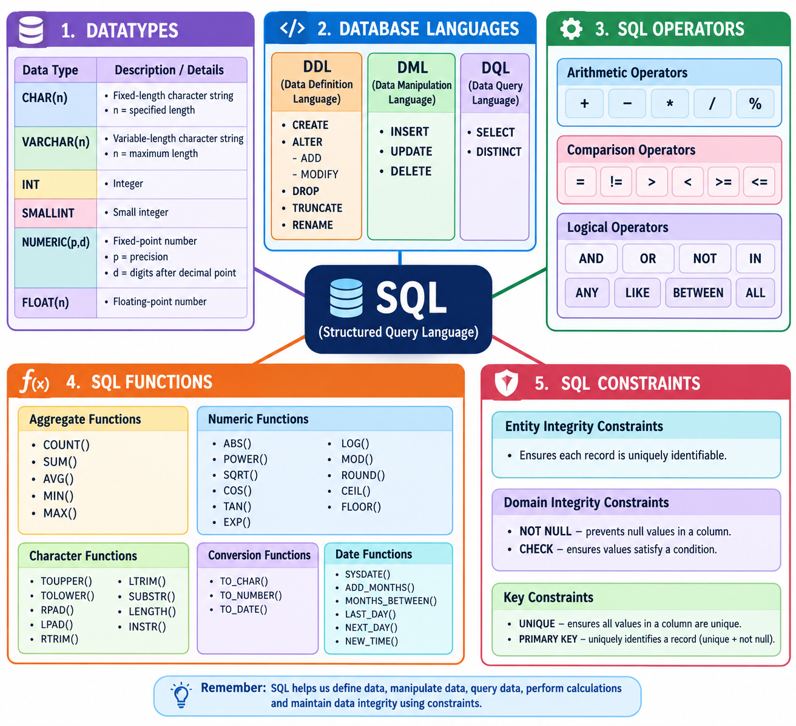

# LJ-DBMS-sem3-chapter3-explained
---

# DBMS — Chapter 3: STRUCTURED QUERY LANGUAGE (SQL)

## STEP 1 — DEEP EXPLANATION

I have gone through the uploaded **DBMS Chapter 3 PPT** slide-by-slide. The PPT contains **40 slides**, covering SQL datatypes, database languages, SQL commands, operators, functions, and constraints.

I will follow the **same order as the PPT** and preserve its terminology.

---

# 1. STRUCTURED QUERY LANGUAGE — SQL

### Definition

**SQL (Structured Query Language)** is a language used to work with databases.

It allows us to:

- Define database structures.
    
- Create tables.
    
- Modify table structures.
    
- Insert records.
    
- Update records.
    
- Delete records.
    
- Retrieve data.
    
- Perform calculations.
    
- Apply constraints to maintain valid and consistent data.
    

### SQL Chapter Structure

According to the PPT, the chapter contains:

```text
STRUCTURED QUERY LANGUAGE (SQL)
│
├── Datatypes
│
├── Database Languages
│   ├── DDL
│   ├── DML
│   └── DQL
│
├── SQL Operators
│   ├── Arithmetic Operators
│   ├── Comparison Operators
│   └── Logical Operators
│
├── SQL Functions
│   ├── Aggregate Functions
│   ├── Numeric Functions
│   ├── Character Functions
│   ├── Conversion Functions
│   └── Date Functions
│
└── SQL Constraints
    ├── Entity Integrity Constraints
    ├── Domain Integrity Constraints
    └── Key Constraints
```

> **Exam Point:** SQL is the central topic of this chapter and is used for defining, manipulating, and querying database data.

---

# 2. DATATYPES

A **datatype** specifies what type of value can be stored in a database column.

The PPT discusses the following datatypes:

|Datatype|Meaning|
|---|---|
|`char(n)`|Fixed-length character string|
|`varchar(n)`|Variable-length character string|
|`int`|Integer|
|`smallint`|Small integer|
|`numeric(p,d)`|Fixed-point number|
|`float(n)`|Floating-point number|

---

## 2.1 CHAR(n)

### Definition

`char(n)` represents a **fixed-length character string**, where `n` is the user-specified length.

### Example

```sql
name CHAR(20)
```

This defines a character field with a fixed length of 20 characters.

### Important Point

The length is **fixed**.

---

## 2.2 VARCHAR(n)

### Definition

`varchar(n)` represents a **variable-length character string**, with a user-specified maximum length `n`.

### Example

```sql
name VARCHAR(20)
```

The maximum length is 20 characters, but the actual stored value can be shorter.

### CHAR vs VARCHAR

|CHAR|VARCHAR|
|---|---|
|Fixed length|Variable length|
|Length is fixed|Maximum length is specified|
|Used for fixed-size character data|Used for variable-size character data|

> **Exam Point:** Remember the keyword **fixed** for `CHAR` and **variable** for `VARCHAR`.

---

# 2.3 INT

### Definition

`int` represents an **integer**.

Example:

```text
10
25
100
-50
```

---

# 2.4 SMALLINT

### Definition

`smallint` represents a **small integer**, described in the PPT as a machine-dependent subset of the integer domain type.

---

# 2.5 NUMERIC(p,d)

### Definition

`numeric(p,d)` represents a **fixed-point number** with user-specified precision.

- `p` = precision
    
- `d` = number of digits to the right of the decimal point
    

### Example

```text
numeric(8,2)
```

Here:

```text
8  → total precision
2  → digits after decimal point
```

---

# 2.6 FLOAT(n)

### Definition

`float(n)` represents a **floating-point number** with user-specified precision of at least `n` digits.

---

# 3. DATABASE LANGUAGES

The PPT introduces SQL commands through different database languages.

The major commands discussed are:

```text
Database Languages
│
├── DDL
│   ├── CREATE
│   ├── ALTER
│   ├── DROP
│   ├── TRUNCATE
│   └── RENAME
│
├── DML
│   ├── INSERT
│   ├── UPDATE
│   └── DELETE
│
└── DQL
    └── SELECT
```

---

# 4. DATA DEFINITION LANGUAGE — DDL

### Full Form

**DDL → Data Definition Language**

### Definition

According to the PPT:

> Data Definition Language statements are used to define the database structure or schema.

DDL works mainly with the **structure of the database**.

### DDL Commands in the PPT

|Command|Purpose|
|---|---|
|`CREATE`|Creates objects in the database|
|`ALTER`|Alters database structure|
|`DROP`|Deletes objects|
|`TRUNCATE`|Removes all records from a table|
|`RENAME`|Renames an object|

---

# 4.1 CREATE

### Definition

`CREATE` is used to create a table or other database object.

### Syntax

```sql
CREATE TABLE <TableName>
(
    column1 datatype(size),
    column2 datatype(size),
    ...
    columnN datatype(size)
);
```

### PPT Example

```sql
CREATE TABLE student
(
    Rollno NUMBER(15),
    Name VARCHAR2(20),
    Age NUMBER(5),
    DOB DATE
);
```

### Output

```text
Table created.
```

### Understanding

The command creates a table called:

```text
student
```

with columns:

```text
student
│
├── Rollno
├── Name
├── Age
└── DOB
```

> **Exam Point:** `CREATE` is used to create database objects/table structures.

---

# 4.2 DESCRIBE

The PPT shows the `DESCRIBE` command for viewing the structure of a table.

### Syntax

```sql
DESCRIBE <TableName>;
```

OR

```sql
DESC <TableName>;
```

### Example

```sql
DESC student;
```

This displays information about the table's columns.

Conceptually:

```text
DESC student
      ↓
Table Structure
      ↓
Column Name + Datatype + Other information
```

### Important Point

`DESC` is a short form of `DESCRIBE`.

> **Exam Point:** `DESCRIBE` / `DESC` is used to see the structure of a table.

---

# 4.3 ALTER TABLE

### Definition

`ALTER` is used to **modify the table structure**.

The PPT explains two operations:

1. Adding new columns
    
2. Modifying columns
    

---

## 4.3.1 Adding New Columns

### Syntax

```sql
ALTER TABLE TableName
ADD
(
    NewColumnName1 Datatype(size),
    NewColumnName2 Datatype(size),
    ...
);
```

### PPT Example

```sql
ALTER TABLE student
ADD
(
    marks NUMBER(15)
);
```

### Purpose

A new column called `marks` is added to the `student` table.

Before:

```text
student
├── Rollno
├── Name
├── Age
└── DOB
```

After:

```text
student
├── Rollno
├── Name
├── Age
├── DOB
└── marks
```

Output:

```text
Table altered.
```

---

# 4.3.2 MODIFY Columns

### Definition

`MODIFY` is used to modify the definition of existing columns.

### Syntax

```sql
ALTER TABLE TableName
MODIFY
(
    ColumnName1 Datatype(size),
    ColumnName2 Datatype(size),
    ...
);
```

### PPT Example

```sql
ALTER TABLE student
MODIFY
(
    marks NUMBER(13)
);
```

Output:

```text
Table altered.
```

---

# 4.4 RENAME TABLE

### Definition

`RENAME` is used to rename a table structure/object.

### Syntax

```sql
RENAME TABLE OldTableName TO NewTableName;
```

### PPT Example

```sql
RENAME TABLE students TO STUDENT_DETAILS;
```

Output:

```text
Table renamed.
```

### Concept

```text
Old Table Name
      │
      │ RENAME
      ↓
New Table Name
```

---

# 5. DATA MANIPULATION LANGUAGE — DML

### Full Form

**DML → Data Manipulation Language**

### Definition

According to the PPT, DML statements are used to manipulate or modify records in the database.

### DML Commands

|Command|Purpose|
|---|---|
|`INSERT`|Inserts records into a table|
|`UPDATE`|Modifies records in a table|
|`DELETE`|Deletes records from a table|

### Important Difference

DDL primarily deals with **database structure**, while DML deals with **records/data**.

---

# 5.1 INSERT

### Definition

`INSERT` is used to insert records into a table.

### Syntax

```sql
INSERT INTO TableName
VALUES
(Value1, Value2, ... ValueN);
```

### PPT Example

```sql
INSERT INTO student
VALUES
(101, 'Hetshree', 21, 18/2/2000);
```

Output:

```text
1 row created.
```

### Concept

```text
Table
  ↓
INSERT
  ↓
New Record Added
```

---

# 5.2 UPDATE

### Definition

`UPDATE` is used to modify records in a table.

### Syntax

```sql
UPDATE TABLENAME
SET ColumnName = 'NewVALUE'
WHERE ColumnName = 'OldVALUE';
```

### PPT Example

```sql
UPDATE student
SET name = 'Heta'
WHERE name = 'Hetshree';
```

Output:

```text
1 row updated.
```

### What happens?

The record containing:

```text
Hetshree
```

is changed to:

```text
Heta
```

> **Exam Point:** `UPDATE` modifies existing records.

---

# 5.3 DELETE

### Definition

`DELETE` is used to delete records from a table.

### Syntax

```sql
DELETE FROM TABLENAME
WHERE ColumnName = 'VALUE';
```

### PPT Example

```sql
DELETE student
WHERE name = 'Heta';
```

Output:

```text
1 row deleted.
```

### Concept

```text
Existing Record
      │
      │ DELETE
      ↓
Record Removed
```

---

# 6. DATA QUERY LANGUAGE — DQL

### Full Form

**DQL → Data Query Language**

### Definition

DQL commands are used to **retrieve data from the database**.

The PPT discusses:

```text
SELECT
```

---

# 6.1 SELECT

### Definition

The `SELECT` clause lists the attributes desired in the result of a query.

The PPT relates this to the **projection operation of relational algebra**.

### Example from PPT

To find the names of all branches in the `loan` relation:

```sql
SELECT branch_name
FROM loan;
```

### Important Point — Duplicates

The PPT states that SQL allows **duplicates in relations as well as in query results**.

For example, if the table contains:

```text
branch_name
-----------
Main
Main
City
City
West
```

A normal `SELECT` may return:

```text
Main
Main
City
City
West
```

---

# 6.2 SELECT DISTINCT

To eliminate duplicate values, use the keyword:

```text
DISTINCT
```

after `SELECT`.

### Example

```sql
SELECT DISTINCT branch_name
FROM loan;
```

Result:

```text
Main
City
West
```

### Difference

|SELECT|SELECT DISTINCT|
|---|---|
|May return duplicate values|Eliminates duplicates|
|Retrieves matching values|Retrieves unique values|

> **Exam Point:** `DISTINCT` is used to remove duplicate values from query results.

---

# 7. SQL OPERATORS

### Definition

The PPT defines a SQL operator as a **reserved word or character used primarily in an SQL statement's WHERE clause to perform operations**, such as comparisons and arithmetic operations.

The PPT covers:

```text
SQL Operators
│
├── Arithmetic Operators
├── Comparison Operators
└── Logical Operators
```

---

# 8. SQL ARITHMETIC OPERATORS

The PPT lists:

```text
+
-
*
/
%
```

The example assumes:

```text
a = 20
b = 10
```

|Operator|Operation|Example|Result|
|---|---|---|--:|
|`+`|Addition|`a+b`|30|
|`-`|Subtraction|`a-b`|10|
|`*`|Multiplication|`a*b`|200|
|`/`|Division|`a/b`|2|
|`%`|Remainder|`a%b`|0|

### 8.1 Addition `+`

Adds the values of two operands.

```text
20 + 10 = 30
```

### 8.2 Subtraction `-`

Subtracts the right-hand operand from the left-hand operand.

```text
20 - 10 = 10
```

### 8.3 Multiplication `*`

Multiplies two operands.

```text
20 × 10 = 200
```

### 8.4 Division `/`

Divides the left-hand operand by the right-hand operand.

```text
20 / 10 = 2
```

### 8.5 Modulus `%`

Divides the left-hand operand by the right-hand operand and returns the **remainder**.

```text
20 % 10 = 0
```

> **Exam Point:** Arithmetic operators are used to perform mathematical operations.

---

# 9. SQL COMPARISON OPERATORS

The PPT covers:

```text
=
!=
>
<
>=
<=
```

Again:

```text
a = 20
b = 10
```

|Operator|Meaning|
|---|---|
|`=`|Equal to|
|`!=`|Not equal to|
|`>`|Greater than|
|`<`|Less than|
|`>=`|Greater than or equal to|
|`<=`|Less than or equal to|

---

## 9.1 Equal To `=`

Checks whether two operands are equal.

```text
a = b
20 = 10
```

Result:

```text
False
```

---

## 9.2 Not Equal To `!=`

Checks whether two operands are different.

```text
a != b
20 != 10
```

Result:

```text
True
```

---

## 9.3 Greater Than `>`

Checks whether the left operand is greater than the right operand.

```text
20 > 10
```

Result:

```text
True
```

**Note:** The PPT's slide text contains a statement saying `(a>b) is not true`, but with its stated values `a=20` and `b=10`, the logical result is **true**. I am preserving the PPT content while flagging this apparent inconsistency rather than silently changing it.

---

## 9.4 Less Than `<`

```text
20 < 10
```

Result:

```text
False
```

---

## 9.5 Greater Than or Equal To `>=`

Checks whether the left operand is greater than or equal to the right operand.

```text
20 >= 10
```

Result:

```text
True
```

---

## 9.6 Less Than or Equal To `<=`

Checks whether the left operand is less than or equal to the right operand.

```text
20 <= 10
```

Result:

```text
False
```

> **Exam Point:** Comparison operators generally produce a condition that can be evaluated as true or false.

---

# 10. SQL LOGICAL OPERATORS

The PPT lists:

```text
AND
OR
NOT
IN
ANY
LIKE
BETWEEN
ALL
```

These operators are useful when conditions need to be combined or checked.

---

## 10.1 LIKE

### Definition

`LIKE` compares a value to similar values using a **wildcard operator**.

It is useful for pattern matching.

Example:

```sql
WHERE name LIKE 'A%'
```

This represents values beginning with `A`.

---

# 10.2 AND

### Definition

`AND` allows multiple conditions to exist in an SQL statement.

Conceptually:

```text
Condition 1
    AND
Condition 2
```

Both conditions need to satisfy the combined condition.

---

# 10.3 ANY

### Definition

`ANY` compares values in a list according to a condition.

---

# 10.4 BETWEEN

### Definition

`BETWEEN` is used to search for values that are **within a set/range of values**.

Example:

```sql
WHERE Age BETWEEN 18 AND 25
```

---

# 10.5 IN

### Definition

`IN` compares a value to a specified list of values.

Example:

```sql
WHERE City IN ('Surat', 'Ahmedabad', 'Rajkot')
```

---

# 10.6 NOT

### Definition

`NOT` reverses the meaning of a logical operator.

Conceptually:

```text
Condition
   ↓
 NOT
   ↓
Reversed condition
```

---

# 10.7 OR

### Definition

`OR` combines multiple conditions in SQL statements.

---

# 10.8 ALL

The PPT lists `ALL` as a SQL logical operator. It is used when comparing a value against all values in a specified set/list.

---

# 11. SQL FUNCTIONS

The PPT classifies SQL functions into:

```text
SQL Functions
│
├── Aggregate
├── Numeric
├── Character
├── Conversion
└── Date
```

---

# 12. AGGREGATE FUNCTIONS

### Definition

An SQL aggregation function performs calculations on **multiple rows of a single column** of a table.

It returns a **single value**.

They are also used to **summarize data**.

### Main Aggregate Functions in PPT

```text
COUNT()
SUM()
AVG()
MIN()
MAX()
```

---

# 12.1 COUNT()

### Definition

`COUNT()` is used to count the number of rows in a database table.

It can work on:

- Numeric data
    
- Non-numeric data
    

### COUNT(*)

The PPT states that:

```sql
COUNT(*)
```

returns the count of all rows in a specified table.

It considers:

- Duplicate rows
    
- NULL
    

### Syntax

```sql
COUNT(*)
```

or

```sql
COUNT([ALL|DISTINCT] expression)
```

### PPT Example

```sql
SELECT COUNT(*)
FROM PRODUCT_MAST;
```

PPT result:

```text
5
```

### Important Exam Point

`COUNT(*)` counts rows in the table.

---

# 12.2 SUM()

### Definition

`SUM()` returns the **sum of an expression** in a `SELECT` statement.

### Syntax

```sql
SELECT SUM(column_name)
FROM table_name
WHERE condition;
```

### PPT Example

```sql
SELECT SUM(Quantity)
FROM OrderDetails;
```

This calculates the total quantity.

---

# 12.3 AVG()

### Definition

`AVG()` returns the **average of an expression**.

### Syntax

```sql
SELECT AVG(column_name)
FROM table_name
WHERE condition;
```

### PPT Example

```sql
SELECT AVG(Quantity)
FROM OrderDetails;
```

---

# 12.4 MIN()

The PPT describes `MIN()` as a function used to return a value from an expression.

### Syntax

```sql
SELECT MIN(column_name)
FROM table_name
WHERE condition;
```

### PPT Example

```sql
SELECT MIN(RATE)
FROM OrderDetails;
```

> **Important:** The PPT's description for `MIN()` says "return the average", which appears to be a wording error. The function name and example identify it as `MIN()`.

---

# 12.5 MAX()

### Syntax

```sql
SELECT MAX(column_name)
FROM table_name
WHERE condition;
```

### PPT Example

```sql
SELECT MAX(RATE)
FROM OrderDetails;
```

The PPT similarly describes `MAX()` using "average", which appears to be a slide wording error; the function is `MAX()`.

---

# 13. NUMERIC FUNCTIONS

The PPT lists the following numeric functions:

```text
ABS()
POWER()
SQRT()
COS()
TAN()
EXP()
LOG()
MOD()
ROUND()
CEIL()
FLOOR()
```

### Function List

|Function|Purpose/Category|
|---|---|
|`ABS()`|Absolute value|
|`POWER()`|Power calculation|
|`SQRT()`|Square root|
|`COS()`|Cosine|
|`TAN()`|Tangent|
|`EXP()`|Exponential calculation|
|`LOG()`|Logarithmic calculation|
|`MOD()`|Modulus/remainder|
|`ROUND()`|Rounds a value|
|`CEIL()`|Ceiling value|
|`FLOOR()`|Floor value|

> **Exam Point:** Memorize the complete list because the PPT directly presents these functions.

---

# 14. CHARACTER FUNCTIONS

The PPT lists:

```text
TOUPPER()
TOLOWER()
RPAD()
LPAD()
RTRIM()
LTRIM()
SUBSTR()
LENGTH()
INSTR()
```

### Function List

|Function|General purpose|
|---|---|
|`TOUPPER()`|Converts text to uppercase|
|`TOLOWER()`|Converts text to lowercase|
|`RPAD()`|Pads characters on the right|
|`LPAD()`|Pads characters on the left|
|`RTRIM()`|Removes trailing characters/spaces|
|`LTRIM()`|Removes leading characters/spaces|
|`SUBSTR()`|Extracts a substring|
|`LENGTH()`|Determines length|
|`INSTR()`|Finds the position of a substring|

---

# 15. CONVERSION FUNCTIONS

The PPT lists three conversion functions:

```text
TO_CHAR()
TO_NUMBER()
TO_DATE()
```

|Function|Purpose|
|---|---|
|`TO_CHAR()`|Converts a value to character representation|
|`TO_NUMBER()`|Converts a value to number|
|`TO_DATE()`|Converts a value to date|

> **Exam Point:** Remember the three conversion functions together: **TO_CHAR, TO_NUMBER, TO_DATE**.

---

# 16. DATE FUNCTIONS

The PPT lists:

```text
SYSDATE()
ADD_MONTHS()
MONTHS_BETWEEN()
LAST_DAY()
NEXT_DAY()
NEW_TIME()
```

### Functions

|Function|General purpose|
|---|---|
|`SYSDATE()`|Provides system date|
|`ADD_MONTHS()`|Adds months to a date|
|`MONTHS_BETWEEN()`|Finds difference in months|
|`LAST_DAY()`|Finds last day of a month|
|`NEXT_DAY()`|Finds next specified day|
|`NEW_TIME()`|Converts time between time zones|

> **Exam Point:** Learn all six date functions given in the PPT.

---

# 17. SQL CONSTRAINTS

### Definition

A **constraint** is a rule that restricts the value that may be present in the database.

The purpose is to make sure that data stored in a database is:

```text
Valid
  +
Correct
  +
Consistent
```

When data is stored or manipulated, certain rules need to be followed. These rules are called **constraints**.

---

# 18. CLASSIFICATION OF SQL CONSTRAINTS

The PPT states:

> SQL Constraints can be classified into two categories.

The subsequent slides describe the categories/components as:

```text
SQL Constraints
│
├── Entity Integrity Constraints
│   │
│   └── Domain Integrity Constraints
│       ├── NOT NULL
│       └── CHECK
│
└── Key Constraints
    ├── UNIQUE
    └── PRIMARY KEY
```

---

# 19. ENTITY INTEGRITY CONSTRAINTS

### Definition

The PPT states that **Entity Integrity Constraints** restrict values in a row or particular table.

The PPT then discusses further classifications.

---

# 20. DOMAIN INTEGRITY CONSTRAINTS

### Definition

Domain Integrity Constraints specify that the value of each column must belong to the **domain of that column**.

According to the PPT, Domain Integrity Constraints include:

```text
Domain Integrity Constraints
│
├── NOT NULL
└── CHECK
```

### NOT NULL

A `NOT NULL` constraint prevents a column from containing a NULL value.

Conceptually:

```text
Column
  ↓
NOT NULL
  ↓
Value must be provided
```

### CHECK

A `CHECK` constraint specifies a condition that a value must satisfy.

Conceptually:

```text
Input Value
     ↓
CHECK condition
     ↓
 ┌───┴────┐
Valid   Invalid
```

---

# 21. KEY CONSTRAINTS

### Definition

The PPT states that Key Constraints ensure that two different rows of the same table can be distinguished uniquely.

According to the PPT, Key Constraints are:

```text
Key Constraints
│
├── UNIQUE
└── PRIMARY KEY
```

### UNIQUE

A `UNIQUE` constraint ensures that values are unique, helping distinguish records.

### PRIMARY KEY

A `PRIMARY KEY` is used to uniquely identify records in a table.

Example:

```text
Student
--------------------------------
RollNo | Name | Age
--------------------------------
101    | A    | 20
102    | B    | 21
103    | C    | 19
```

Here, `RollNo` can serve as a key that distinguishes the rows.

> **Exam Point:** The PPT specifically associates **UNIQUE** and **PRIMARY KEY** with Key Constraints.

---

# CHAPTER SUMMARY

This chapter introduces **Structured Query Language (SQL)** and its major components.

```text
SQL
│
├── Datatypes
│   ├── CHAR
│   ├── VARCHAR
│   ├── INT
│   ├── SMALLINT
│   ├── NUMERIC
│   └── FLOAT
│
├── Database Languages
│   ├── DDL
│   ├── DML
│   └── DQL
│
├── Operators
│   ├── Arithmetic
│   ├── Comparison
│   └── Logical
│
├── Functions
│   ├── Aggregate
│   ├── Numeric
│   ├── Character
│   ├── Conversion
│   └── Date
│
└── Constraints
    ├── Entity Integrity
    ├── Domain Integrity
    └── Key Constraints
```

---

# IMPORTANT DEFINITIONS

1. **SQL:** Structured Query Language used for working with databases.
    
2. **Datatype:** Specifies the type of value that can be stored in a column.
    
3. **DDL:** Data Definition Language used to define database structure/schema.
    
4. **DML:** Data Manipulation Language used to manipulate database records.
    
5. **DQL:** Data Query Language used to retrieve data.
    
6. **CREATE:** Used to create database objects.
    
7. **ALTER:** Used to modify table structure.
    
8. **INSERT:** Used to insert records.
    
9. **UPDATE:** Used to modify records.
    
10. **DELETE:** Used to delete records.
    
11. **SELECT:** Used to retrieve data.
    
12. **DISTINCT:** Used to eliminate duplicate values from query results.
    
13. **SQL Operator:** A reserved word or character used to perform operations in an SQL statement.
    
14. **Aggregate Function:** Performs calculations on multiple rows and returns a single value.
    
15. **Constraint:** A rule restricting values that may be present in a database.
    
16. **Domain Integrity Constraint:** Specifies that column values must belong to the domain of that column.
    
17. **Key Constraint:** Ensures that rows can be distinguished uniquely.
    

---

# IMPORTANT DIFFERENCES

## DDL vs DML

|DDL|DML|
|---|---|
|Data Definition Language|Data Manipulation Language|
|Works with database structure|Works with records/data|
|CREATE|INSERT|
|ALTER|UPDATE|
|DROP|DELETE|
|TRUNCATE|—|
|RENAME|—|

---

## DML vs DQL

|DML|DQL|
|---|---|
|Manipulates records|Retrieves data|
|INSERT|SELECT|
|UPDATE|—|
|DELETE|—|

---

## SELECT vs SELECT DISTINCT

|SELECT|SELECT DISTINCT|
|---|---|
|May return duplicates|Removes duplicates|
|Retrieves matching values|Retrieves unique values|

---

## CHAR vs VARCHAR

|CHAR|VARCHAR|
|---|---|
|Fixed-length character string|Variable-length character string|
|Length is fixed|Maximum length is specified|

---

## Arithmetic vs Comparison Operators

|Arithmetic|Comparison|
|---|---|
|Performs calculations|Compares values|
|`+`, `-`, `*`, `/`, `%`|`=`, `!=`, `>`, `<`, `>=`, `<=`|

---

# IMPORTANT EXAM POINTS

⭐ **1.** SQL stands for **Structured Query Language**.

⭐ **2.** `char(n)` is a fixed-length character string.

⭐ **3.** `varchar(n)` is a variable-length character string.

⭐ **4.** DDL is used to define database structure/schema.

⭐ **5.** DDL commands in the PPT are:

```text
CREATE
ALTER
DROP
TRUNCATE
RENAME
```

⭐ **6.** DML commands are:

```text
INSERT
UPDATE
DELETE
```

⭐ **7.** DQL uses `SELECT` to retrieve data.

⭐ **8.** `DISTINCT` removes duplicate values from query results.

⭐ **9.** Arithmetic operators include:

```text
+  -  *  /  %
```

⭐ **10.** Comparison operators include:

```text
=  !=  >  <  >=  <=
```

⭐ **11.** Logical operators listed in the PPT are:

```text
AND
OR
NOT
IN
ANY
LIKE
BETWEEN
ALL
```

⭐ **12.** Aggregate functions are:

```text
COUNT()
SUM()
AVG()
MIN()
MAX()
```

⭐ **13.** `COUNT(*)` counts rows in a specified table.

⭐ **14.** Numeric functions include `ABS()`, `POWER()`, `SQRT()`, `COS()`, `TAN()`, `EXP()`, `LOG()`, `MOD()`, `ROUND()`, `CEIL()`, and `FLOOR()`.

⭐ **15.** Character functions include `TOUPPER()`, `TOLOWER()`, `RPAD()`, `LPAD()`, `RTRIM()`, `LTRIM()`, `SUBSTR()`, `LENGTH()`, and `INSTR()`.

⭐ **16.** Conversion functions are:

```text
TO_CHAR()
TO_NUMBER()
TO_DATE()
```

⭐ **17.** Date functions are:

```text
SYSDATE()
ADD_MONTHS()
MONTHS_BETWEEN()
LAST_DAY()
NEXT_DAY()
NEW_TIME()
```

⭐ **18.** A constraint is a rule that restricts values in a database.

⭐ **19.** The PPT identifies `NOT NULL` and `CHECK` under Domain Integrity Constraints.

⭐ **20.** The PPT identifies `UNIQUE` and `PRIMARY KEY` under Key Constraints.

---

## STEP 1 STATUS

**Deep Explanation: ✅ COMPLETED**

**PPT slides covered: 40 / 40**

I have also flagged apparent wording inconsistencies in the PPT rather than silently changing them.

### Next in your required workflow:

**STEP 2 — Complete Mind Map**

When you say **“next”**, I will continue directly with the **complete text-based mind map**.

---

# STEP 2 — COMPLETE CHAPTER MIND MAP

## DBMS — CHAPTER 3: STRUCTURED QUERY LANGUAGE (SQL)

```text
STRUCTURED QUERY LANGUAGE (SQL)
│
├── 1. DATATYPES
│   │
│   ├── CHAR(n)
│   │   ├── Fixed-length character string
│   │   └── n = specified length
│   │
│   ├── VARCHAR(n)
│   │   ├── Variable-length character string
│   │   └── n = maximum length
│   │
│   ├── INT
│   │   └── Integer
│   │
│   ├── SMALLINT
│   │   └── Small integer
│   │
│   ├── NUMERIC(p,d)
│   │   ├── Fixed-point number
│   │   ├── p = precision
│   │   └── d = digits after decimal point
│   │
│   └── FLOAT(n)
│       └── Floating-point number
│
├── 2. DATABASE LANGUAGES
│   │
│   ├── DDL
│   │   ├── Data Definition Language
│   │   ├── CREATE
│   │   ├── ALTER
│   │   │   ├── ADD
│   │   │   └── MODIFY
│   │   ├── DROP
│   │   ├── TRUNCATE
│   │   └── RENAME
│   │
│   ├── DML
│   │   ├── Data Manipulation Language
│   │   ├── INSERT
│   │   ├── UPDATE
│   │   └── DELETE
│   │
│   └── DQL
│       ├── Data Query Language
│       └── SELECT
│           └── DISTINCT
│
├── 3. SQL OPERATORS
│   │
│   ├── Arithmetic Operators
│   │   ├── +
│   │   ├── -
│   │   ├── *
│   │   ├── /
│   │   └── %
│   │
│   ├── Comparison Operators
│   │   ├── =
│   │   ├── !=
│   │   ├── >
│   │   ├── <
│   │   ├── >=
│   │   └── <=
│   │
│   └── Logical Operators
│       ├── AND
│       ├── OR
│       ├── NOT
│       ├── IN
│       ├── ANY
│       ├── LIKE
│       ├── BETWEEN
│       └── ALL
│
├── 4. SQL FUNCTIONS
│   │
│   ├── Aggregate Functions
│   │   ├── COUNT()
│   │   ├── SUM()
│   │   ├── AVG()
│   │   ├── MIN()
│   │   └── MAX()
│   │
│   ├── Numeric Functions
│   │   ├── ABS()
│   │   ├── POWER()
│   │   ├── SQRT()
│   │   ├── COS()
│   │   ├── TAN()
│   │   ├── EXP()
│   │   ├── LOG()
│   │   ├── MOD()
│   │   ├── ROUND()
│   │   ├── CEIL()
│   │   └── FLOOR()
│   │
│   ├── Character Functions
│   │   ├── TOUPPER()
│   │   ├── TOLOWER()
│   │   ├── RPAD()
│   │   ├── LPAD()
│   │   ├── RTRIM()
│   │   ├── LTRIM()
│   │   ├── SUBSTR()
│   │   ├── LENGTH()
│   │   └── INSTR()
│   │
│   ├── Conversion Functions
│   │   ├── TO_CHAR()
│   │   ├── TO_NUMBER()
│   │   └── TO_DATE()
│   │
│   └── Date Functions
│       ├── SYSDATE()
│       ├── ADD_MONTHS()
│       ├── MONTHS_BETWEEN()
│       ├── LAST_DAY()
│       ├── NEXT_DAY()
│       └── NEW_TIME()
│
└── 5. SQL CONSTRAINTS
    │
    ├── Entity Integrity Constraints
    │
    ├── Domain Integrity Constraints
    │   ├── NOT NULL
    │   └── CHECK
    │
    └── Key Constraints
        ├── UNIQUE
        └── PRIMARY KEY
```

---

# QUICK REVISION TREE

```text
                    SQL
                     │
       ┌─────────────┼─────────────┐
       │             │             │
   DATATYPES     LANGUAGES     OPERATORS
       │             │             │
   ┌───┴───┐      ┌──┼──┐      ┌───┼────┐
   │       │      │  │  │      │   │    │
 CHAR   VARCHAR   DDL DML DQL  Arithmetic
 INT    SMALLINT                Comparison
 NUMERIC FLOAT                  Logical
       
                     │
                     ▼
                  FUNCTIONS
                     │
       ┌─────────────┼─────────────┐
       │      │      │      │      │
   Aggregate Numeric Character Conversion Date
       
                     │
                     ▼
                CONSTRAINTS
                     │
          ┌──────────┴──────────┐
          │                     │
       Domain                  Key
          │                     │
    ┌─────┴─────┐         ┌─────┴─────┐
 NOT NULL      CHECK     UNIQUE    PRIMARY KEY
```

---

# EXAM REVISION — MOST IMPORTANT BRANCHES

```text
SQL
│
├── DDL → CREATE, ALTER, DROP, TRUNCATE, RENAME
│
├── DML → INSERT, UPDATE, DELETE
│
├── DQL → SELECT, DISTINCT
│
├── Operators
│   ├── Arithmetic → + - * / %
│   ├── Comparison → = != > < >= <=
│   └── Logical → AND OR NOT IN ANY LIKE BETWEEN ALL
│
├── Functions
│   ├── Aggregate → COUNT SUM AVG MIN MAX
│   ├── Numeric → ABS POWER SQRT COS TAN EXP LOG MOD ROUND CEIL FLOOR
│   ├── Character → TOUPPER TOLOWER RPAD LPAD RTRIM LTRIM SUBSTR LENGTH INSTR
│   ├── Conversion → TO_CHAR TO_NUMBER TO_DATE
│   └── Date → SYSDATE ADD_MONTHS MONTHS_BETWEEN LAST_DAY NEXT_DAY NEW_TIME
│
└── Constraints
    ├── Entity Integrity
    ├── Domain Integrity → NOT NULL, CHECK
    └── Key Constraints → UNIQUE, PRIMARY KEY
```

## STEP 2 STATUS

**Complete Mind Map: ✅ COMPLETED**

All major branches and the important subtopics from the chapter are included.

### Next:

**STEP 3 — Mind Map Image**

Say **“next”** and I will create the **visual mind-map image** for this complete chapter.

---

<p align="center">
  
</p>

---
# STEP 4 — MCQs WITH ANSWERS

## DBMS Chapter 3 — Structured Query Language (SQL)

I will cover the PPT systematically so that **no major topic is skipped**.

---

## A. SQL & DATATYPES

### Q1. What does SQL stand for?

A) Simple Query Language  
B) Structured Query Language  
C) Standard Query Language  
D) System Query Language

**Answer: B) Structured Query Language**

---

### Q2. Which of the following is a topic included in the SQL chapter?

A) Datatypes  
B) Database Languages  
C) SQL Operators  
D) All of the above

**Answer: D) All of the above**

---

### Q3. Which datatype represents a fixed-length character string?

A) `VARCHAR(n)`  
B) `FLOAT(n)`  
C) `CHAR(n)`  
D) `INT`

**Answer: C) `CHAR(n)`**

---

### Q4. In `CHAR(n)`, what does `n` represent?

A) Number of rows  
B) User-specified length  
C) Number of columns  
D) Precision

**Answer: B) User-specified length**

---

### Q5. Which datatype represents a variable-length character string?

A) `CHAR(n)`  
B) `VARCHAR(n)`  
C) `INT`  
D) `SMALLINT`

**Answer: B) `VARCHAR(n)`**

---

### Q6. In `VARCHAR(n)`, `n` represents:

A) Maximum length  
B) Minimum length  
C) Number of rows  
D) Decimal places

**Answer: A) Maximum length**

---

### Q7. Which datatype represents an integer?

A) `INT`  
B) `FLOAT`  
C) `CHAR`  
D) `VARCHAR`

**Answer: A) `INT`**

---

### Q8. According to the PPT, `SMALLINT` represents:

A) Large integer  
B) Small integer  
C) Floating-point number  
D) Character string

**Answer: B) Small integer**

---

### Q9. Which datatype represents a fixed-point number?

A) `FLOAT(n)`  
B) `NUMERIC(p,d)`  
C) `VARCHAR(n)`  
D) `CHAR(n)`

**Answer: B) `NUMERIC(p,d)`**

---

### Q10. In `NUMERIC(p,d)`, `p` represents:

A) Number of tables  
B) Precision  
C) Number of rows  
D) Date precision

**Answer: B) Precision**

---

### Q11. In `NUMERIC(p,d)`, `d` represents:

A) Digits to the right of the decimal point  
B) Number of database tables  
C) Number of rows  
D) Datatype size

**Answer: A) Digits to the right of the decimal point**

---

### Q12. Which datatype represents a floating-point number?

A) `INT`  
B) `CHAR(n)`  
C) `FLOAT(n)`  
D) `SMALLINT`

**Answer: C) `FLOAT(n)`**

---

# B. DATA DEFINITION LANGUAGE — DDL

### Q13. What does DDL stand for?

A) Data Development Language  
B) Data Definition Language  
C) Database Definition Logic  
D) Data Description Language

**Answer: B) Data Definition Language**

---

### Q14. DDL statements are used to define the:

A) Database structure or schema  
B) Individual records only  
C) Query results only  
D) Arithmetic operations

**Answer: A) Database structure or schema**

---

### Q15. Which command is used to create objects in the database?

A) `INSERT`  
B) `CREATE`  
C) `UPDATE`  
D) `SELECT`

**Answer: B) `CREATE`**

---

### Q16. Which DDL command alters the structure of the database?

A) `ALTER`  
B) `UPDATE`  
C) `MODIFY`  
D) `INSERT`

**Answer: A) `ALTER`**

---

### Q17. Which command deletes objects from the database?

A) `DELETE`  
B) `DROP`  
C) `REMOVE`  
D) `TRUNCATE`

**Answer: B) `DROP`**

---

### Q18. Which DDL command removes all records from a table?

A) `DELETE`  
B) `DROP`  
C) `TRUNCATE`  
D) `REMOVE`

**Answer: C) `TRUNCATE`**

---

### Q19. Which command is used to rename an object?

A) `CHANGE`  
B) `RENAME`  
C) `ALTER NAME`  
D) `MODIFY`

**Answer: B) `RENAME`**

---

## CREATE TABLE

### Q20. Which command is used to create a table?

A) `MAKE TABLE`  
B) `CREATE TABLE`  
C) `NEW TABLE`  
D) `TABLE CREATE`

**Answer: B) `CREATE TABLE`**

---

### Q21. Which of the following is the correct general syntax for creating a table?

A)

```sql
CREATE TABLE TableName
(column datatype);
```

B)

```sql
MAKE TableName;
```

C)

```sql
TABLE CREATE TableName;
```

D)

```sql
CREATE DATABASE TableName;
```

**Answer: A) `CREATE TABLE TableName (column datatype);`**

---

### Q22. In the PPT example, what is the name of the table created?

A) `employee`  
B) `student`  
C) `students`  
D) `college`

**Answer: B) `student`**

---

### Q23. Which column appears in the PPT's `student` table example?

A) `Rollno`  
B) `Salary`  
C) `Department`  
D) `Address`

**Answer: A) `Rollno`**

---

### Q24. What output is produced after successfully creating the table?

A) Row created  
B) Table altered  
C) Table created  
D) Table inserted

**Answer: C) Table created**

---

# DESCRIBE

### Q25. Which command is used to describe a table?

A) `DISPLAY`  
B) `DESCRIBE`  
C) `SHOWDATA`  
D) `VIEW`

**Answer: B) `DESCRIBE`**

---

### Q26. What is the short form of `DESCRIBE` shown in the PPT?

A) `DCR`  
B) `DESC`  
C) `DSB`  
D) `DES`

**Answer: B) `DESC`**

---

### Q27. Which command correctly describes the `student` table?

A) `DESC student;`  
B) `DESCRIBE student;`  
C) Both A and B  
D) `SHOW student;`

**Answer: C) Both A and B**

---

# ALTER TABLE

### Q28. The `ALTER` command is used to:

A) Retrieve records  
B) Modify table structure  
C) Insert records  
D) Delete individual records

**Answer: B) Modify table structure**

---

### Q29. Which keyword is used with `ALTER TABLE` to add new columns?

A) `INSERT`  
B) `ADD`  
C) `CREATE`  
D) `NEW`

**Answer: B) `ADD`**

---

### Q30. Which command adds a `marks` column to the `student` table?

A)

```sql
ALTER TABLE student ADD (marks number(15));
```

B)

```sql
UPDATE student ADD marks;
```

C)

```sql
CREATE marks student;
```

D)

```sql
INSERT marks INTO student;
```

**Answer: A) `ALTER TABLE student ADD (marks number(15));`**

---

### Q31. Which keyword is used to modify an existing column?

A) `CHANGE`  
B) `MODIFY`  
C) `UPDATE COLUMN`  
D) `EDIT`

**Answer: B) `MODIFY`**

---

### Q32. Which command modifies the `marks` column according to the PPT example?

A)

```sql
ALTER TABLE student MODIFY (marks number(13));
```

B)

```sql
UPDATE student marks number(13);
```

C)

```sql
MODIFY TABLE student marks;
```

D)

```sql
ALTER student UPDATE marks;
```

**Answer: A) `ALTER TABLE student MODIFY (marks number(13));`**

---

# RENAME

### Q33. Which command is used to rename a table?

A) `CHANGE TABLE`  
B) `RENAME TABLE`  
C) `ALTER TABLE NAME`  
D) `MODIFY TABLE`

**Answer: B) `RENAME TABLE`**

---

### Q34. In the PPT example, `students` is renamed to:

A) `STUDENT`  
B) `STUDENT_DETAILS`  
C) `STUDENT_DATA`  
D) `STUDENT_INFO`

**Answer: B) `STUDENT_DETAILS`**

---

# C. DATA MANIPULATION LANGUAGE — DML

### Q35. What does DML stand for?

A) Data Manipulation Language  
B) Database Management Language  
C) Data Modification Logic  
D) Database Manipulation Logic

**Answer: A) Data Manipulation Language**

---

### Q36. Which commands are listed under DML in the PPT?

A) `CREATE`, `ALTER`, `DROP`  
B) `INSERT`, `UPDATE`, `DELETE`  
C) `SELECT`, `DESC`, `CREATE`  
D) `RENAME`, `TRUNCATE`, `DROP`

**Answer: B) `INSERT`, `UPDATE`, `DELETE`**

---

### Q37. Which DML command inserts records into a table?

A) `INSERT`  
B) `ADD`  
C) `CREATE`  
D) `SELECT`

**Answer: A) `INSERT`**

---

### Q38. Which DML command modifies records?

A) `ALTER`  
B) `UPDATE`  
C) `MODIFY TABLE`  
D) `CHANGE`

**Answer: B) `UPDATE`**

---

### Q39. Which DML command deletes records from a table?

A) `DROP`  
B) `DELETE`  
C) `REMOVE TABLE`  
D) `TRUNCATE`

**Answer: B) `DELETE`**

---

# INSERT

### Q40. Which command is used to insert records into a table?

A)

```sql
INSERT INTO student VALUES (...);
```

B)

```sql
ADD student VALUES (...);
```

C)

```sql
CREATE student VALUES (...);
```

D)

```sql
UPDATE student VALUES (...);
```

**Answer: A) `INSERT INTO student VALUES (...);`**

---

### Q41. According to the PPT, a successful INSERT operation produces:

A) `1 row created.`  
B) `1 row inserted.`  
C) `Table created.`  
D) `Record modified.`

**Answer: A) `1 row created.`**

---

# UPDATE

### Q42. Which command is used to modify existing records?

A) `ALTER`  
B) `UPDATE`  
C) `MODIFY`  
D) `CHANGE`

**Answer: B) `UPDATE`**

---

### Q43. In the PPT example, `Hetshree` is changed to:

A) `Hetal`  
B) `Heta`  
C) `Hiral`  
D) `Heena`

**Answer: B) `Heta`**

---

### Q44. Which clause identifies the records to be modified in the PPT's UPDATE example?

A) `FROM`  
B) `WHERE`  
C) `HAVING`  
D) `GROUP BY`

**Answer: B) `WHERE`**

---

# DELETE

### Q45. Which command removes records from a table?

A) `DELETE`  
B) `DROP`  
C) `TRUNCATE TABLE STRUCTURE`  
D) `REMOVE`

**Answer: A) `DELETE`**

---

### Q46. Which clause is used in the PPT's DELETE example to specify the record?

A) `WHERE`  
B) `FROM`  
C) `SET`  
D) `SELECT`

**Answer: A) `WHERE`**

---

# D. DATA QUERY LANGUAGE — DQL

### Q47. What does DQL stand for?

A) Data Query Language  
B) Database Query Logic  
C) Data Question Language  
D) Database Quality Language

**Answer: A) Data Query Language**

---

### Q48. DQL is used to:

A) Create tables  
B) Retrieve data from the database  
C) Delete tables  
D) Modify table structure

**Answer: B) Retrieve data from the database**

---

### Q49. Which command is used to retrieve data?

A) `INSERT`  
B) `SELECT`  
C) `UPDATE`  
D) `ALTER`

**Answer: B) `SELECT`**

---

### Q50. In relational algebra, the `SELECT` clause corresponds to the:

A) Join operation  
B) Projection operation  
C) Union operation  
D) Difference operation

**Answer: B) Projection operation**

---

### Q51. Which SQL statement retrieves `branch_name` from the `loan` relation?

A)

```sql
SELECT branch_name FROM loan;
```

B)

```sql
GET branch_name FROM loan;
```

C)

```sql
DISPLAY branch_name loan;
```

D)

```sql
SHOW branch_name IN loan;
```

**Answer: A) `SELECT branch_name FROM loan;`**

---

### Q52. SQL allows duplicates in:

A) Relations only  
B) Query results only  
C) Both relations and query results  
D) Neither relations nor query results

**Answer: C) Both relations and query results**

---

### Q53. Which keyword is used to eliminate duplicates from query results?

A) `UNIQUE`  
B) `DISTINCT`  
C) `REMOVE`  
D) `DIFFERENT`

**Answer: B) `DISTINCT`**

---

### Q54. Which query removes duplicate branch names?

A)

```sql
SELECT UNIQUE branch_name FROM loan;
```

B)

```sql
SELECT DISTINCT branch_name FROM loan;
```

C)

```sql
SELECT DIFFERENT branch_name FROM loan;
```

D)

```sql
SELECT branch_name UNIQUE FROM loan;
```

**Answer: B) `SELECT DISTINCT branch_name FROM loan;`**

---

# E. SQL OPERATORS

### Q55. A SQL operator is primarily used in which clause according to the PPT?

A) `SELECT` clause  
B) `WHERE` clause  
C) `FROM` clause  
D) `CREATE` clause

**Answer: B) `WHERE` clause**

---

### Q56. SQL operators can perform:

A) Comparisons  
B) Arithmetic operations  
C) Both A and B  
D) Neither A nor B

**Answer: C) Both A and B**

---

# F. ARITHMETIC OPERATORS

### Q57. Which of the following is an SQL arithmetic operator?

A) `+`  
B) `>`  
C) `AND`  
D) `LIKE`

**Answer: A) `+`**

---

### Q58. Which operator performs addition?

A) `-`  
B) `+`  
C) `*`  
D) `%`

**Answer: B) `+`**

---

### Q59. If `a = 20` and `b = 10`, what is `a+b`?

A) 10  
B) 20  
C) 30  
D) 200

**Answer: C) 30**

---

### Q60. If `a = 20` and `b = 10`, what is `a-b`?

A) 30  
B) 10  
C) 200  
D) 2

**Answer: B) 10**

---

### Q61. If `a = 20` and `b = 10`, what is `a*b`?

A) 30  
B) 10  
C) 200  
D) 2

**Answer: C) 200**

---

### Q62. If `a = 20` and `b = 10`, what is `a/b`?

A) 2  
B) 10  
C) 20  
D) 30

**Answer: A) 2**

---

### Q63. Which operator returns the remainder?

A) `/`  
B) `*`  
C) `%`  
D) `-`

**Answer: C) `%`**

---

### Q64. If `a = 20` and `b = 10`, what is `a%b`?

A) 2  
B) 10  
C) 0  
D) 200

**Answer: C) 0**

---

# G. COMPARISON OPERATORS

### Q65. Which operator checks whether two values are equal?

A) `=`  
B) `!=`  
C) `>`  
D) `<`

**Answer: A) `=`**

---

### Q66. Which operator represents "not equal to"?

A) `<>`  
B) `!=`  
C) `~=`  
D) `NOT=`

**Answer: B) `!=`**

---

### Q67. Which operator means "greater than"?

A) `<`  
B) `>`  
C) `>=`  
D) `=>`

**Answer: B) `>`**

---

### Q68. Which operator means "less than"?

A) `>`  
B) `<`  
C) `<=`  
D) `=<`

**Answer: B) `<`**

---

### Q69. Which operator means "greater than or equal to"?

A) `=>`  
B) `>=`  
C) `>>`  
D) `==`

**Answer: B) `>=`**

---

### Q70. Which operator means "less than or equal to"?

A) `=<`  
B) `<=`  
C) `<<`  
D) `==`

**Answer: B) `<=`**

---

### Q71. If `a = 20` and `b = 10`, then `a != b` is:

A) True  
B) False  
C) Null  
D) Error

**Answer: A) True**

---

### Q72. If `a = 20` and `b = 10`, then `a < b` is:

A) True  
B) False  
C) Null  
D) Error

**Answer: B) False**

---

# H. LOGICAL OPERATORS

### Q73. Which of the following is listed as a SQL logical operator in the PPT?

A) `AND`  
B) `OR`  
C) `NOT`  
D) All of the above

**Answer: D) All of the above**

---

### Q74. Which logical operator combines multiple conditions?

A) `OR`  
B) `CHAR`  
C) `MOD`  
D) `COUNT`

**Answer: A) `OR`**

---

### Q75. Which operator allows multiple conditions to exist in an SQL statement?

A) `AND`  
B) `IN`  
C) `LIKE`  
D) `ALL`

**Answer: A) `AND`**

---

### Q76. Which operator reverses the meaning of a logical operator?

A) `AND`  
B) `OR`  
C) `NOT`  
D) `ANY`

**Answer: C) `NOT`**

---

### Q77. Which operator compares a value to a specified list value?

A) `IN`  
B) `BETWEEN`  
C) `LIKE`  
D) `ALL`

**Answer: A) `IN`**

---

### Q78. Which operator is used to search for values within a set of values?

A) `ANY`  
B) `BETWEEN`  
C) `LIKE`  
D) `NOT`

**Answer: B) `BETWEEN`**

---

### Q79. Which operator compares a value to similar values using a wildcard operator?

A) `LIKE`  
B) `IN`  
C) `ALL`  
D) `AND`

**Answer: A) `LIKE`**

---

### Q80. Which operator compares values in a list according to a condition?

A) `ANY`  
B) `LIKE`  
C) `NOT`  
D) `BETWEEN`

**Answer: A) `ANY`**

---

# I. SQL FUNCTIONS

### Q81. Which of the following is NOT one of the five function categories shown in the PPT?

A) Aggregate  
B) Numeric  
C) Character  
D) Transaction

**Answer: D) Transaction**

---

### Q82. Which category contains `COUNT()`?

A) Numeric  
B) Aggregate  
C) Character  
D) Date

**Answer: B) Aggregate**

---

### Q83. Which category contains `TO_CHAR()`?

A) Conversion  
B) Numeric  
C) Aggregate  
D) Date

**Answer: A) Conversion**

---

### Q84. Which category contains `SYSDATE()`?

A) Character  
B) Numeric  
C) Date  
D) Aggregate

**Answer: C) Date**

---

# J. AGGREGATE FUNCTIONS

### Q85. Aggregate functions perform calculations on:

A) Multiple rows of a single column  
B) Only one row  
C) Only table names  
D) Database schemas

**Answer: A) Multiple rows of a single column**

---

### Q86. An aggregate function returns:

A) Multiple tables  
B) A single value  
C) A database schema  
D) A datatype

**Answer: B) A single value**

---

### Q87. Aggregate functions are also used to:

A) Delete tables  
B) Summarize data  
C) Create databases  
D) Rename objects

**Answer: B) Summarize data**

---

### Q88. Which is an aggregate function?

A) `COUNT()`  
B) `SUBSTR()`  
C) `TO_DATE()`  
D) `SYSDATE()`

**Answer: A) `COUNT()`**

---

### Q89. Which of the following is the complete aggregate-function set shown in the PPT?

A) `COUNT(), SUM(), AVG(), MIN(), MAX()`  
B) `ABS(), MOD(), ROUND()`  
C) `TO_CHAR(), TO_NUMBER(), TO_DATE()`  
D) `SYSDATE(), NEXT_DAY(), LAST_DAY()`

**Answer: A) `COUNT(), SUM(), AVG(), MIN(), MAX()`**

---

# K. COUNT()

### Q90. What is the purpose of `COUNT()`?

A) To calculate average  
B) To count rows  
C) To calculate maximum  
D) To convert data

**Answer: B) To count rows**

---

### Q91. According to the PPT, `COUNT()` can work on:

A) Numeric data only  
B) Non-numeric data only  
C) Both numeric and non-numeric data types  
D) Date data only

**Answer: C) Both numeric and non-numeric data types**

---

### Q92. What does `COUNT(*)` return?

A) Sum of all rows  
B) Count of all rows in a specified table  
C) Average of all rows  
D) Maximum row value

**Answer: B) Count of all rows in a specified table**

---

### Q93. According to the PPT, `COUNT(*)` considers:

A) Only unique rows  
B) Duplicate and NULL  
C) Only NULL  
D) Neither duplicate nor NULL

**Answer: B) Duplicate and NULL**

---

### Q94. Which is a valid form shown for the COUNT function?

A) `COUNT(*)`  
B) `COUNT([ALL|DISTINCT] expression)`  
C) Both A and B  
D) `COUNT ROW`

**Answer: C) Both A and B**

---

### Q95. What is the result shown in the PPT for:

```sql
SELECT COUNT(*)
FROM PRODUCT_MAST;
```

A) 2  
B) 3  
C) 5  
D) 10

**Answer: C) 5**

---

# L. SUM()

### Q96. What does `SUM()` return?

A) Average  
B) Sum of an expression  
C) Minimum  
D) Number of rows

**Answer: B) Sum of an expression**

---

### Q97. Which query is shown in the PPT for calculating total quantity?

A)

```sql
SELECT SUM(Quantity)
FROM OrderDetails;
```

B)

```sql
SELECT AVG(Quantity)
FROM OrderDetails;
```

C)

```sql
SELECT COUNT(Quantity)
FROM OrderDetails;
```

D)

```sql
SELECT MAX(Quantity)
FROM OrderDetails;
```

**Answer: A) `SELECT SUM(Quantity) FROM OrderDetails;`**

---

# M. AVG()

### Q98. What does `AVG()` return?

A) Sum  
B) Average  
C) Minimum  
D) Maximum

**Answer: B) Average**

---

### Q99. Which query calculates the average quantity?

A)

```sql
SELECT AVG(Quantity)
FROM OrderDetails;
```

B)

```sql
SELECT SUM(Quantity)
FROM OrderDetails;
```

C)

```sql
SELECT MIN(Quantity)
FROM OrderDetails;
```

D)

```sql
SELECT COUNT(Quantity)
FROM OrderDetails;
```

**Answer: A) `SELECT AVG(Quantity) FROM OrderDetails;`**

---

# N. MIN() AND MAX()

### Q100. Which function is used to find the minimum value?

A) `MIN()`  
B) `LOW()`  
C) `SMALL()`  
D) `BOTTOM()`

**Answer: A) `MIN()`**

---

### Q101. Which function is used to find the maximum value?

A) `HIGH()`  
B) `MAX()`  
C) `TOP()`  
D) `LARGE()`

**Answer: B) `MAX()`**

---

### Q102. Which query is shown in the PPT for `MIN()`?

A)

```sql
SELECT MIN(RATE)
FROM OrderDetails;
```

B)

```sql
SELECT MAX(RATE)
FROM OrderDetails;
```

C)

```sql
SELECT AVG(RATE)
FROM OrderDetails;
```

D)

```sql
SELECT SUM(RATE)
FROM OrderDetails;
```

**Answer: A) `SELECT MIN(RATE) FROM OrderDetails;`**

---

### Q103. Which query is shown in the PPT for `MAX()`?

A)

```sql
SELECT MIN(RATE)
FROM OrderDetails;
```

B)

```sql
SELECT MAX(RATE)
FROM OrderDetails;
```

C)

```sql
SELECT AVG(RATE)
FROM OrderDetails;
```

D)

```sql
SELECT COUNT(RATE)
FROM OrderDetails;
```

**Answer: B) `SELECT MAX(RATE) FROM OrderDetails;`**

---

# O. NUMERIC FUNCTIONS

### Q104. Which of the following is a numeric function listed in the PPT?

A) `ABS()`  
B) `POWER()`  
C) `SQRT()`  
D) All of the above

**Answer: D) All of the above**

---

### Q105. Which function is listed for calculating absolute value?

A) `ABS()`  
B) `MOD()`  
C) `ROUND()`  
D) `FLOOR()`

**Answer: A) `ABS()`**

---

### Q106. Which function is used for power calculation?

A) `POWER()`  
B) `EXP()`  
C) `SQRT()`  
D) `ABS()`

**Answer: A) `POWER()`**

---

### Q107. Which numeric function is used for square root?

A) `ROOT()`  
B) `SQRT()`  
C) `SQUARE()`  
D) `SRQ()`

**Answer: B) `SQRT()`**

---

### Q108. Which function is listed for cosine?

A) `COS()`  
B) `COST()`  
C) `CO()`  
D) `COSINE()`

**Answer: A) `COS()`**

---

### Q109. Which function is listed for tangent?

A) `TAN()`  
B) `TANG()`  
C) `TG()`  
D) `TANGENT()`

**Answer: A) `TAN()`**

---

### Q110. Which function is used for exponential calculation?

A) `EXP()`  
B) `POWER()`  
C) `EXPO()`  
D) `E()`

**Answer: A) `EXP()`**

---

### Q111. Which function is listed for logarithmic calculation?

A) `LOG()`  
B) `LN()`  
C) `LOGARITHM()`  
D) `LGR()`

**Answer: A) `LOG()`**

---

### Q112. Which function is listed for modulus?

A) `MOD()`  
B) `REMAINDER()`  
C) `REM()`  
D) `MODULUS()`

**Answer: A) `MOD()`**

---

### Q113. Which function is used for rounding according to the PPT list?

A) `ROUND()`  
B) `APPROX()`  
C) `RND()`  
D) `NEAREST()`

**Answer: A) `ROUND()`**

---

### Q114. Which numeric function is listed for ceiling?

A) `CEIL()`  
B) `TOP()`  
C) `UP()`  
D) `CEILINGVALUE()`

**Answer: A) `CEIL()`**

---

### Q115. Which numeric function is listed for floor?

A) `FLOOR()`  
B) `DOWN()`  
C) `LOWER()`  
D) `FLR()`

**Answer: A) `FLOOR()`**

---

# P. CHARACTER FUNCTIONS

### Q116. Which of the following is a character function?

A) `TOUPPER()`  
B) `TOLOWER()`  
C) `SUBSTR()`  
D) All of the above

**Answer: D) All of the above**

---

### Q117. Which function is listed to convert characters to uppercase?

A) `TOUPPER()`  
B) `UPPERCASE()`  
C) `UP()`  
D) `CAPITAL()`

**Answer: A) `TOUPPER()`**

---

### Q118. Which function is listed to convert characters to lowercase?

A) `LOWER()`  
B) `TOLOWER()`  
C) `LOWCASE()`  
D) `DOWN()`

**Answer: B) `TOLOWER()`**

---

### Q119. Which function is listed for right padding?

A) `LPAD()`  
B) `RPAD()`  
C) `RIGHTPAD()`  
D) `PADRIGHT()`

**Answer: B) `RPAD()`**

---

### Q120. Which function is listed for left padding?

A) `LPAD()`  
B) `RPAD()`  
C) `LEFTPAD()`  
D) `PADLEFT()`

**Answer: A) `LPAD()`**

---

### Q121. Which function is listed for removing trailing characters?

A) `LTRIM()`  
B) `RTRIM()`  
C) `TRIMRIGHT()`  
D) `RIGHTTRIM()`

**Answer: B) `RTRIM()`**

---

### Q122. Which function is listed for removing leading characters?

A) `LTRIM()`  
B) `RTRIM()`  
C) `LEFTTRIM()`  
D) `TRIMLEFT()`

**Answer: A) `LTRIM()`**

---

### Q123. Which function is used to extract a substring?

A) `SUBSTR()`  
B) `EXTRACTTEXT()`  
C) `SUBSTRINGVALUE()`  
D) `TEXT()`

**Answer: A) `SUBSTR()`**

---

### Q124. Which function is listed for finding length?

A) `SIZE()`  
B) `LENGTH()`  
C) `LEN()`  
D) `COUNTCHAR()`

**Answer: B) `LENGTH()`**

---

### Q125. Which character function is listed for finding a position within a string?

A) `INSTR()`  
B) `POSITION()`  
C) `FIND()`  
D) `LOCATE()`

**Answer: A) `INSTR()`**

---

# Q. CONVERSION FUNCTIONS

### Q126. Which of the following is a conversion function?

A) `TO_CHAR()`  
B) `TO_NUMBER()`  
C) `TO_DATE()`  
D) All of the above

**Answer: D) All of the above**

---

### Q127. Which function converts a value to character representation?

A) `TO_CHAR()`  
B) `TO_TEXT()`  
C) `CHAR()`  
D) `CONVERT_CHAR()`

**Answer: A) `TO_CHAR()`**

---

### Q128. Which function is listed to convert a value to number?

A) `TO_INT()`  
B) `TO_NUMBER()`  
C) `NUMBER()`  
D) `CONVERT_NUMBER()`

**Answer: B) `TO_NUMBER()`**

---

### Q129. Which function is listed for conversion to date?

A) `TO_DATE()`  
B) `DATE()`  
C) `CONVERT_DATE()`  
D) `DATEVALUE()`

**Answer: A) `TO_DATE()`**

---

# R. DATE FUNCTIONS

### Q130. Which of the following is a date function listed in the PPT?

A) `SYSDATE()`  
B) `ADD_MONTHS()`  
C) `LAST_DAY()`  
D) All of the above

**Answer: D) All of the above**

---

### Q131. Which function is listed as `SYSDATE()`?

A) Character function  
B) Date function  
C) Numeric function  
D) Aggregate function

**Answer: B) Date function**

---

### Q132. Which function is used to add months according to the PPT?

A) `MONTH_ADD()`  
B) `ADD_MONTHS()`  
C) `PLUS_MONTH()`  
D) `MONTHS_ADD()`

**Answer: B) `ADD_MONTHS()`**

---

### Q133. Which function is listed for finding the number of months between dates?

A) `MONTHS_BETWEEN()`  
B) `BETWEEN_MONTHS()`  
C) `MONTH_DIFF()`  
D) `DATE_MONTH()`

**Answer: A) `MONTHS_BETWEEN()`**

---

### Q134. Which function is listed for finding the last day?

A) `LAST_DAY()`  
B) `END_DAY()`  
C) `FINAL_DAY()`  
D) `MONTH_END()`

**Answer: A) `LAST_DAY()`**

---

### Q135. Which function is listed for finding the next day?

A) `NEXT_DAY()`  
B) `FOLLOW_DAY()`  
C) `NEXTDATE()`  
D) `AFTER_DAY()`

**Answer: A) `NEXT_DAY()`**

---

### Q136. Which function is included in the PPT's date-function list?

A) `NEW_TIME()`  
B) `CHANGE_TIME()`  
C) `TIME_CHANGE()`  
D) `CONVERT_TIME()`

**Answer: A) `NEW_TIME()`**

---

# S. SQL CONSTRAINTS

### Q137. What is a constraint?

A) A database table  
B) A rule that restricts values that may be present in the database  
C) A SQL operator  
D) A datatype

**Answer: B) A rule that restricts values that may be present in the database**

---

### Q138. Data stored in the database should be:

A) Valid  
B) Correct  
C) Consistent  
D) All of the above

**Answer: D) All of the above**

---

### Q139. SQL constraints are used when data is:

A) Stored and manipulated  
B) Only displayed  
C) Only printed  
D) Only renamed

**Answer: A) Stored and manipulated**

---

### Q140. According to the PPT, SQL constraints are classified into:

A) One category  
B) Two categories  
C) Three categories  
D) Four categories

**Answer: B) Two categories**

---

# T. ENTITY INTEGRITY & DOMAIN INTEGRITY

### Q141. Which is one of the constraint categories discussed in the PPT?

A) Entity Integrity Constraints  
B) Network Constraints  
C) File Constraints  
D) Memory Constraints

**Answer: A) Entity Integrity Constraints**

---

### Q142. Entity Integrity Constraints restrict values in:

A) A row or particular table  
B) Only the database name  
C) Only SQL queries  
D) Only operators

**Answer: A) A row or particular table**

---

### Q143. Domain Integrity specifies that the value of each column must belong to:

A) The database  
B) The domain of that column  
C) Another table  
D) The SQL language

**Answer: B) The domain of that column**

---

### Q144. Which two constraints are listed under Domain Integrity Constraints?

A) `UNIQUE` and `PRIMARY KEY`  
B) `NOT NULL` and `CHECK`  
C) `INSERT` and `UPDATE`  
D) `CREATE` and `ALTER`

**Answer: B) `NOT NULL` and `CHECK`**

---

### Q145. Which constraint prevents a column from accepting NULL values?

A) `CHECK`  
B) `NOT NULL`  
C) `UNIQUE`  
D) `PRIMARY KEY`

**Answer: B) `NOT NULL`**

---

### Q146. Which constraint specifies a condition that a value must satisfy?

A) `CHECK`  
B) `NOT NULL`  
C) `UNIQUE`  
D) `SELECT`

**Answer: A) `CHECK`**

---

# U. KEY CONSTRAINTS

### Q147. Key Constraints ensure that different rows can be:

A) Deleted  
B) Distinguished uniquely  
C) Duplicated  
D) Converted

**Answer: B) Distinguished uniquely**

---

### Q148. Which two constraints are listed under Key Constraints?

A) `NOT NULL` and `CHECK`  
B) `UNIQUE` and `PRIMARY KEY`  
C) `INSERT` and `DELETE`  
D) `ALTER` and `DROP`

**Answer: B) `UNIQUE` and `PRIMARY KEY`**

---

### Q149. Which constraint is specifically listed as a Key Constraint?

A) `UNIQUE`  
B) `CHECK`  
C) `NOT NULL`  
D) `DEFAULT`

**Answer: A) `UNIQUE`**

---

### Q150. Which constraint is used to uniquely identify rows according to the PPT?

A) `PRIMARY KEY`  
B) `CHECK`  
C) `NOT NULL`  
D) `LIKE`

**Answer: A) `PRIMARY KEY`**

---

# 🔎 MCQ COVERAGE CHECK

|PPT Topic|MCQs Covered|
|---|--:|
|SQL Introduction|Q1–Q2|
|Datatypes|Q3–Q12|
|DDL|Q13–Q19|
|CREATE TABLE|Q20–Q24|
|DESCRIBE / DESC|Q25–Q27|
|ALTER TABLE — ADD|Q28–Q30|
|ALTER TABLE — MODIFY|Q31–Q32|
|RENAME|Q33–Q34|
|DML|Q35–Q39|
|INSERT|Q40–Q41|
|UPDATE|Q42–Q44|
|DELETE|Q45–Q46|
|DQL|Q47–Q54|
|SQL Operators|Q55–Q56|
|Arithmetic Operators|Q57–Q64|
|Comparison Operators|Q65–Q72|
|Logical Operators|Q73–Q80|
|SQL Functions|Q81–Q84|
|Aggregate Functions|Q85–Q89|
|COUNT()|Q90–Q95|
|SUM()|Q96–Q97|
|AVG()|Q98–Q99|
|MIN() / MAX()|Q100–Q103|
|Numeric Functions|Q104–Q115|
|Character Functions|Q116–Q125|
|Conversion Functions|Q126–Q129|
|Date Functions|Q130–Q136|
|SQL Constraints|Q137–Q140|
|Entity Integrity|Q141–Q142|
|Domain Integrity|Q143–Q146|
|Key Constraints|Q147–Q150|

### MCQs completed: **150**

### Missing-topic check: **No major PPT topic is left uncovered. ✅**

**STEP 4 — MCQs: COMPLETED**

---

### Next section in your required workflow:

**STEP 5 — 1-MARK QUESTIONS + ANSWERS**

I will continue from **Q1 of the 1-Mark section**, not restart the MCQ section.

---

# STEP 5 — 1-MARK QUESTIONS WITH ANSWERS

**DBMS Chapter 3 — Structured Query Language (SQL)**

These questions are based on the **uploaded PPT**, following its terminology and order. They focus on direct facts, definitions, full forms, commands, functions, operators, syntax, and PPT examples.

---

# A. SQL & DATATYPES

### Q1. What is the full form of SQL?

**Answer:** **SQL → Structured Query Language.**

### Q2. What is a datatype?

**Answer:** A datatype specifies the type of value that can be stored.

### Q3. What is `CHAR(n)`?

**Answer:** `CHAR(n)` is a **fixed-length character string** with user-specified length `n`.

### Q4. What is `VARCHAR(n)`?

**Answer:** `VARCHAR(n)` is a **variable-length character string** with user-specified maximum length `n`.

### Q5. What does `n` represent in `CHAR(n)`?

**Answer:** `n` represents the **user-specified length**.

### Q6. What does `n` represent in `VARCHAR(n)`?

**Answer:** `n` represents the **maximum length**.

### Q7. What is `INT`?

**Answer:** `INT` represents an **integer**.

### Q8. What is `SMALLINT`?

**Answer:** `SMALLINT` represents a **small integer**.

### Q9. What is `NUMERIC(p,d)`?

**Answer:** It represents a **fixed-point number** with user-specified precision.

### Q10. What does `p` represent in `NUMERIC(p,d)`?

**Answer:** `p` represents the **precision**.

### Q11. What does `d` represent in `NUMERIC(p,d)`?

**Answer:** `d` represents the number of digits to the **right of the decimal point**.

### Q12. What is `FLOAT(n)`?

**Answer:** `FLOAT(n)` represents a **floating-point number** with user-specified precision of at least `n` digits.

### Q13. Which datatype is fixed-length?

**Answer:** `CHAR(n)`.

### Q14. Which datatype is variable-length?

**Answer:** `VARCHAR(n)`.

### Q15. Which datatype represents a fixed-point number?

**Answer:** `NUMERIC(p,d)`.

### Q16. Which datatype represents a floating-point number?

**Answer:** `FLOAT(n)`.

---

# B. DDL — DATA DEFINITION LANGUAGE

### Q17. What is the full form of DDL?

**Answer:** **DDL → Data Definition Language.**

### Q18. What is DDL used for?

**Answer:** DDL statements are used to define the **database structure or schema**.

### Q19. Name the DDL commands given in the PPT.

**Answer:** `CREATE`, `ALTER`, `DROP`, `TRUNCATE`, and `RENAME`.

### Q20. What is the purpose of `CREATE`?

**Answer:** `CREATE` is used to **create objects in the database**.

### Q21. What is the purpose of `ALTER`?

**Answer:** `ALTER` is used to **alter the structure of the database**.

### Q22. What is the purpose of `DROP`?

**Answer:** `DROP` is used to **delete objects from the database**.

### Q23. What is the purpose of `TRUNCATE`?

**Answer:** `TRUNCATE` is used to **remove all records from a table**.

### Q24. What is the purpose of `RENAME`?

**Answer:** `RENAME` is used to **rename a table structure**.

---

# C. CREATE TABLE

### Q25. Which command is used to create a table?

**Answer:** `CREATE TABLE`.

### Q26. Write the general syntax of `CREATE TABLE`.

**Answer:**

```sql
CREATE TABLE <TableName>
(
    column1 datatype(size),
    column2 datatype(size),
    ...
);
```

### Q27. What table is created in the PPT example?

**Answer:** `student`.

### Q28. Name one column of the PPT's `student` table.

**Answer:** `Rollno`.  
_(Other columns are `Name`, `Age`, and `DOB`.)_

### Q29. What datatype is used for `Name` in the PPT example?

**Answer:** `VARCHAR2(20)`.

### Q30. What datatype is used for `DOB` in the PPT example?

**Answer:** `DATE`.

### Q31. What output is obtained after successful table creation?

**Answer:** **Table created.**

---

# D. DESCRIBE / DESC

### Q32. Which command is used to describe a table?

**Answer:** `DESCRIBE`.

### Q33. What is the short form of `DESCRIBE`?

**Answer:** `DESC`.

### Q34. Write the syntax of `DESCRIBE`.

**Answer:**

```sql
DESCRIBE <TableName>;
```

### Q35. Write the alternative syntax for describing a table.

**Answer:**

```sql
DESC <TableName>;
```

### Q36. Which command is used in the PPT to describe `student`?

**Answer:**

```sql
DESC student;
```

---

# E. ALTER TABLE

### Q37. What is `ALTER` used for?

**Answer:** It is used to **modify table structure**.

### Q38. Name the two operations of `ALTER TABLE` shown in the PPT.

**Answer:** **Adding new columns** and **modifying columns**.

### Q39. Which keyword is used to add new columns?

**Answer:** `ADD`.

### Q40. Which keyword is used to modify existing columns?

**Answer:** `MODIFY`.

### Q41. Which column is added in the PPT example?

**Answer:** `marks`.

### Q42. What datatype is initially given to `marks` in the ADD example?

**Answer:** `NUMBER(15)`.

### Q43. What datatype is given to `marks` in the MODIFY example?

**Answer:** `NUMBER(13)`.

### Q44. What output is obtained after successfully altering a table?

**Answer:** **Table altered.**

---

# F. RENAME

### Q45. What command is used to rename a table?

**Answer:** `RENAME`.

### Q46. Write the syntax shown for renaming a table.

**Answer:**

```sql
RENAME TABLE OldTableName TO NewTableName;
```

### Q47. What is `students` renamed to in the PPT?

**Answer:** `STUDENT_DETAILS`.

### Q48. What output is obtained after successful renaming?

**Answer:** **Table renamed.**

---

# G. DML — DATA MANIPULATION LANGUAGE

### Q49. What is the full form of DML?

**Answer:** **DML → Data Manipulation Language.**

### Q50. What is DML used for?

**Answer:** DML statements are used to **manipulate or modify database records**.

> **PPT wording note:** The slide describes DML as manipulating/modifying the database structure/schema, but its listed commands operate on records.

### Q51. Name the DML commands given in the PPT.

**Answer:** `INSERT`, `UPDATE`, and `DELETE`.

### Q52. What is `INSERT` used for?

**Answer:** `INSERT` is used to **insert records into a table**.

### Q53. What is `UPDATE` used for?

**Answer:** `UPDATE` is used to **modify records in a table**.

### Q54. What is `DELETE` used for?

**Answer:** `DELETE` is used to **delete records from a table**.

---

# H. INSERT

### Q55. Write the basic `INSERT` syntax from the PPT.

**Answer:**

```sql
INSERT INTO TABLE <TableName>
VALUES (Value1, Value2, ... ValueN);
```

### Q56. What table is used in the INSERT example?

**Answer:** `student`.

### Q57. What Roll number is inserted in the PPT example?

**Answer:** `101`.

### Q58. What name is inserted in the PPT example?

**Answer:** `Hetshree`.

### Q59. What age is inserted in the PPT example?

**Answer:** `21`.

### Q60. What output is produced by the successful INSERT example?

**Answer:** **1 row created.**

---

# I. UPDATE

### Q61. Which command modifies existing records?

**Answer:** `UPDATE`.

### Q62. Which clause is used to identify the record to be updated?

**Answer:** `WHERE`.

### Q63. What name is changed in the PPT example?

**Answer:** `Hetshree`.

### Q64. What is `Hetshree` changed to?

**Answer:** `Heta`.

### Q65. What output is produced by the UPDATE example?

**Answer:** **1 row updated.**

### Q66. Which column is modified in the PPT's UPDATE example?

**Answer:** `name`.

---

# J. DELETE

### Q67. Which command deletes records from a table?

**Answer:** `DELETE`.

### Q68. Which clause is used in the PPT's DELETE syntax?

**Answer:** `WHERE`.

### Q69. Which name is deleted in the PPT example?

**Answer:** `Heta`.

### Q70. What output is produced by the DELETE example?

**Answer:** **1 row deleted.**

---

# K. DQL — DATA QUERY LANGUAGE

### Q71. What is the full form of DQL?

**Answer:** **DQL → Data Query Language.**

### Q72. What is DQL used for?

**Answer:** DQL is used to **retrieve data from the database**.

### Q73. Which command is discussed under DQL?

**Answer:** `SELECT`.

### Q74. What does the `SELECT` clause list?

**Answer:** It lists the **attributes desired in the result of a query**.

### Q75. Which relational algebra operation corresponds to the `SELECT` clause according to the PPT?

**Answer:** **Projection operation.**

### Q76. What keyword is used to eliminate duplicates?

**Answer:** `DISTINCT`.

### Q77. Where is `DISTINCT` placed?

**Answer:** It is placed **after `SELECT`**.

### Q78. Which relation is used in the PPT's `DISTINCT` example?

**Answer:** `loan`.

### Q79. Which attribute is selected in the PPT's `DISTINCT` example?

**Answer:** `branch_name`.

### Q80. Write the PPT's DISTINCT query.

**Answer:**

```sql
SELECT DISTINCT branch_name
FROM loan;
```

---

# L. SQL OPERATORS

### Q81. What is an SQL operator?

**Answer:** An SQL operator is a **reserved word or character** used primarily in an SQL statement's `WHERE` clause to perform operations.

### Q82. Name two types of operations mentioned in the operator definition.

**Answer:** **Comparisons and arithmetic operations.**

### Q83. Where are SQL operators primarily used according to the PPT?

**Answer:** In the **`WHERE` clause**.

### Q84. Name the three categories of SQL operators covered in the PPT.

**Answer:** **Arithmetic, Comparison, and Logical operators.**

---

# M. ARITHMETIC OPERATORS

### Q85. Name the arithmetic operators given in the PPT.

**Answer:** `+`, `-`, `*`, `/`, `%`.

### Q86. What does `+` do?

**Answer:** It **adds the values of both operands**.

### Q87. What does `-` do?

**Answer:** It subtracts the **right-hand operand from the left-hand operand**.

### Q88. What does `*` do?

**Answer:** It **multiplies the values of both operands**.

### Q89. What does `/` do?

**Answer:** It divides the **left-hand operand by the right-hand operand**.

### Q90. What does `%` return?

**Answer:** It returns the **remainder**.

### Q91. What is the value of `a+b` when `a=20` and `b=10`?

**Answer:** `30`.

### Q92. What is the value of `a-b` when `a=20` and `b=10`?

**Answer:** `10`.

### Q93. What is the value of `a*b` when `a=20` and `b=10`?

**Answer:** `200`.

### Q94. What is the value of `a/b` when `a=20` and `b=10`?

**Answer:** `2`.

### Q95. What is the value of `a%b` when `a=20` and `b=10`?

**Answer:** `0`.

---

# N. COMPARISON OPERATORS

### Q96. Name the comparison operators given in the PPT.

**Answer:** `=`, `!=`, `>`, `<`, `>=`, `<=`.

### Q97. What does `=` check?

**Answer:** It checks whether two operand values are **equal**.

### Q98. What does `!=` check?

**Answer:** It checks whether two operand values are **not equal**.

### Q99. What does `>` check?

**Answer:** It checks whether the left operand is **greater than** the right operand.

### Q100. What does `<` check?

**Answer:** It checks whether the left operand is **less than** the right operand.

### Q101. What does `>=` check?

**Answer:** It checks whether the left operand is **greater than or equal to** the right operand.

### Q102. What does `<=` check?

**Answer:** It checks whether the left operand is **less than or equal to** the right operand.

### Q103. What values are assigned to `a` and `b` in the PPT comparison examples?

**Answer:** `a = 20` and `b = 10`.

### Q104. According to the PPT, what is the result stated for `(a=b)`?

**Answer:** **Not true.**

### Q105. According to the PPT, what is the result stated for `(a!=b)`?

**Answer:** **True.**

### Q106. According to the PPT, what is the result stated for `(a>b)`?

**Answer:** **Not true.**

### Q107. According to the PPT, what is the result stated for `(a<b)`?

**Answer:** **True.**

### Q108. According to the PPT, what is the result stated for `(a>=b)`?

**Answer:** **Not true.**

### Q109. According to the PPT, what is the result stated for `(a<=b)`?

**Answer:** **True.**

> **PPT note:** These stated comparison results are internally inconsistent with `a=20` and `b=10` for some operators. The answers above reproduce what the PPT itself states rather than silently correcting the source.

---

# O. LOGICAL OPERATORS

### Q110. Name the logical operators listed in the PPT.

**Answer:** `AND`, `OR`, `NOT`, `IN`, `ANY`, `LIKE`, `BETWEEN`, and `ALL`.

### Q111. What does `LIKE` do?

**Answer:** It compares a value to similar values using a **wildcard operator**.

### Q112. What does `AND` do?

**Answer:** It allows the existence of **multiple conditions** in an SQL statement.

### Q113. What does `ANY` do?

**Answer:** It compares the **values in a list according to the condition**.

### Q114. What does `BETWEEN` do?

**Answer:** It is used to search for values that are **within a set of values**.

### Q115. What does `IN` do?

**Answer:** It compares a value to a **specified list value**.

### Q116. What does `NOT` do?

**Answer:** It **reverses the meaning** of a logical operator.

### Q117. What does `OR` do?

**Answer:** It **combines multiple conditions** in an SQL statement.

### Q118. Which logical operator is used for wildcard-based comparison?

**Answer:** `LIKE`.

### Q119. Which operator searches for values within a set?

**Answer:** `BETWEEN`.

### Q120. Which operator compares a value with a specified list?

**Answer:** `IN`.

---

# P. SQL FUNCTIONS

### Q121. Name the five categories of SQL functions in the PPT.

**Answer:** **Aggregate, Numeric, Character, Conversion, and Date functions.**

### Q122. What is an aggregate function?

**Answer:** It performs calculations on **multiple rows of a single column** of a table and returns a single value.

### Q123. What are aggregate functions also used for?

**Answer:** They are used to **summarize data**.

---

# Q. AGGREGATE FUNCTIONS

### Q124. Name the aggregate functions given in the PPT.

**Answer:** `COUNT()`, `SUM()`, `AVG()`, `MIN()`, and `MAX()`.

### Q125. What does `COUNT()` do?

**Answer:** It counts the **number of rows** in a database table.

### Q126. Can `COUNT()` work with numeric and non-numeric data types?

**Answer:** **Yes.**

### Q127. What does `COUNT(*)` return?

**Answer:** It returns the **count of all rows** in a specified table.

### Q128. What does `COUNT(*)` consider according to the PPT?

**Answer:** It considers **duplicate and NULL**.

### Q129. What result is shown for `SELECT COUNT(*) FROM PRODUCT_MAST;`?

**Answer:** **5**.

### Q130. What does `SUM()` return?

**Answer:** It returns the **sum of an expression**.

### Q131. What does `AVG()` return?

**Answer:** It returns the **average of an expression**.

### Q132. What does `MIN()` return according to its intended function?

**Answer:** It returns the **minimum value** of an expression.

### Q133. What does `MAX()` return according to its intended function?

**Answer:** It returns the **maximum value** of an expression.

### Q134. Which column is used in the PPT's `SUM()` example?

**Answer:** `Quantity`.

### Q135. Which table is used in the PPT's `SUM()` example?

**Answer:** `OrderDetails`.

### Q136. Which column is used in the PPT's `AVG()` example?

**Answer:** `Quantity`.

### Q137. Which table is used in the PPT's `AVG()` example?

**Answer:** `OrderDetails`.

### Q138. Which column is used in the PPT's `MIN()` example?

**Answer:** `RATE`.

### Q139. Which table is used in the PPT's `MIN()` example?

**Answer:** `OrderDetails`.

### Q140. Which column is used in the PPT's `MAX()` example?

**Answer:** `RATE`.

### Q141. Which table is used in the PPT's `MAX()` example?

**Answer:** `OrderDetails`.

---

# R. NUMERIC FUNCTIONS

### Q142. Name the numeric functions listed in the PPT.

**Answer:** `ABS()`, `POWER()`, `SQRT()`, `COS()`, `TAN()`, `EXP()`, `LOG()`, `MOD()`, `ROUND()`, `CEIL()`, and `FLOOR()`.

### Q143. What is the first numeric function listed?

**Answer:** `ABS()`.

### Q144. What function is listed for power?

**Answer:** `POWER()`.

### Q145. What function is listed for square root?

**Answer:** `SQRT()`.

### Q146. What function is listed for cosine?

**Answer:** `COS()`.

### Q147. What function is listed for tangent?

**Answer:** `TAN()`.

### Q148. What function is listed for exponential calculation?

**Answer:** `EXP()`.

### Q149. What function is listed for logarithmic calculation?

**Answer:** `LOG()`.

### Q150. What function is listed for modulus?

**Answer:** `MOD()`.

### Q151. What function is listed for rounding?

**Answer:** `ROUND()`.

### Q152. What function is listed for ceiling?

**Answer:** `CEIL()`.

### Q153. What function is listed for floor?

**Answer:** `FLOOR()`.

---

# S. CHARACTER FUNCTIONS

### Q154. Name all character functions listed in the PPT.

**Answer:** `TOUPPER()`, `TOLOWER()`, `RPAD()`, `LPAD()`, `RTRIM()`, `LTRIM()`, `SUBSTR()`, `LENGTH()`, and `INSTR()`.

### Q155. Which function is listed for uppercase conversion?

**Answer:** `TOUPPER()`.

### Q156. Which function is listed for lowercase conversion?

**Answer:** `TOLOWER()`.

### Q157. Which function is listed for right padding?

**Answer:** `RPAD()`.

### Q158. Which function is listed for left padding?

**Answer:** `LPAD()`.

### Q159. Which function is listed for right trimming?

**Answer:** `RTRIM()`.

### Q160. Which function is listed for left trimming?

**Answer:** `LTRIM()`.

### Q161. Which function is listed for extracting a substring?

**Answer:** `SUBSTR()`.

### Q162. Which function is listed for finding length?

**Answer:** `LENGTH()`.

### Q163. Which function is listed for finding a position in a string?

**Answer:** `INSTR()`.

---

# T. CONVERSION FUNCTIONS

### Q164. Name the conversion functions listed in the PPT.

**Answer:** `TO_CHAR()`, `TO_NUMBER()`, and `TO_DATE()`.

### Q165. Which function converts to character?

**Answer:** `TO_CHAR()`.

### Q166. Which function converts to number?

**Answer:** `TO_NUMBER()`.

### Q167. Which function converts to date?

**Answer:** `TO_DATE()`.

### Q168. How many conversion functions are listed in the PPT?

**Answer:** **Three.**

---

# U. DATE FUNCTIONS

### Q169. Name all date functions listed in the PPT.

**Answer:** `SYSDATE()`, `ADD_MONTHS()`, `MONTHS_BETWEEN()`, `LAST_DAY()`, `NEXT_DAY()`, and `NEW_TIME()`.

### Q170. Which function is used for the system date?

**Answer:** `SYSDATE()`.

### Q171. Which function is used to add months?

**Answer:** `ADD_MONTHS()`.

### Q172. Which function determines months between dates?

**Answer:** `MONTHS_BETWEEN()`.

### Q173. Which function is used for the last day?

**Answer:** `LAST_DAY()`.

### Q174. Which function is used for the next day?

**Answer:** `NEXT_DAY()`.

### Q175. Which function is listed for changing/converting time?

**Answer:** `NEW_TIME()`.

### Q176. How many date functions are listed in the PPT?

**Answer:** **Six.**

---

# V. SQL CONSTRAINTS

### Q177. What is a constraint?

**Answer:** A constraint is a **rule that restricts the value that may be present in the database**.

### Q178. Why are constraints required?

**Answer:** They ensure that stored data is **valid, correct, and consistent**.

### Q179. When should rules be followed according to the PPT?

**Answer:** When data is **stored or manipulated** in the database.

### Q180. How many categories does the PPT state for SQL constraints?

**Answer:** **Two categories.**

---

# W. ENTITY INTEGRITY & DOMAIN INTEGRITY

### Q181. What are Entity Integrity Constraints?

**Answer:** They are constraints that restrict values in a **row or particular table**.

### Q182. What is Domain Integrity?

**Answer:** It specifies that the value of each column must belong to the **domain of that column**.

### Q183. Which constraints are listed under Domain Integrity?

**Answer:** `NOT NULL` and `CHECK`.

### Q184. What does `NOT NULL` ensure?

**Answer:** It ensures that a column does not contain a **NULL value**.

### Q185. What does `CHECK` specify?

**Answer:** It specifies a **condition** that a value must satisfy.

### Q186. Name the two Domain Integrity Constraints in the PPT.

**Answer:** **NOT NULL and CHECK.**

---

# X. KEY CONSTRAINTS

### Q187. What are Key Constraints?

**Answer:** Key Constraints ensure that two different rows of the same table can be **distinguished uniquely**.

### Q188. Which constraints are listed as Key Constraints?

**Answer:** `UNIQUE` and `PRIMARY KEY`.

### Q189. What does `UNIQUE` ensure?

**Answer:** It ensures that values used for identification are **unique**.

### Q190. What is a `PRIMARY KEY` used for?

**Answer:** It is used to **uniquely identify rows** of a table.

### Q191. Name the two Key Constraints given in the PPT.

**Answer:** **UNIQUE and PRIMARY KEY.**

---

# 🔍 1-MARK COVERAGE CHECK

|PPT Topic|1-Mark Coverage|
|---|---|
|SQL Introduction|✅|
|Datatypes|✅|
|`CHAR(n)`|✅|
|`VARCHAR(n)`|✅|
|`INT`|✅|
|`SMALLINT`|✅|
|`NUMERIC(p,d)`|✅|
|`FLOAT(n)`|✅|
|DDL|✅|
|CREATE|✅|
|DESCRIBE / DESC|✅|
|ALTER|✅|
|ADD|✅|
|MODIFY|✅|
|RENAME|✅|
|DML|✅|
|INSERT|✅|
|UPDATE|✅|
|DELETE|✅|
|DQL|✅|
|SELECT|✅|
|DISTINCT|✅|
|SQL Operators|✅|
|Arithmetic Operators|✅|
|Comparison Operators|✅|
|Logical Operators|✅|
|Aggregate Functions|✅|
|COUNT|✅|
|SUM|✅|
|AVG|✅|
|MIN|✅|
|MAX|✅|
|Numeric Functions|✅|
|Character Functions|✅|
|Conversion Functions|✅|
|Date Functions|✅|
|SQL Constraints|✅|
|Entity Integrity|✅|
|Domain Integrity|✅|
|NOT NULL|✅|
|CHECK|✅|
|Key Constraints|✅|
|UNIQUE|✅|
|PRIMARY KEY|✅|

## 1-Mark Questions Completed: **191**

### Any 1-mark topic/question left?

**No major 1-mark topic from the 40-slide PPT is left. ✅**

The direct PPT facts, definitions, commands, syntax-related facts, examples, operators, function names, and constraints have been covered.

---

### Next section

**STEP 6 — 2-MARK QUESTIONS + ANSWERS**

When you say **“next”**, I will continue directly with the **2-mark question bank**.

---

# STEP 6 — 2-MARK QUESTIONS WITH ANSWERS

## DBMS Chapter 3 — SQL

Below is the **2-mark question bank**, continuing from the completed 1-mark section. Questions are kept different from the MCQs and focus on short explanations, comparisons, syntax, examples, and concepts from the PPT.

---

# A. SQL DATATYPES

### Q1. Differentiate between `CHAR(n)` and `VARCHAR(n)`.

**Answer:**

|`CHAR(n)`|`VARCHAR(n)`|
|---|---|
|Fixed-length character string|Variable-length character string|
|Length is fixed as specified|Uses variable length up to the specified maximum|

**Example:** `CHAR(10)` and `VARCHAR(10)`.

---

### Q2. What is the purpose of `NUMERIC(p,d)`?

**Answer:**  
`NUMERIC(p,d)` is used to store a **fixed-point number**.

- `p` → precision
    
- `d` → number of digits to the right of the decimal point.
    

---

### Q3. Differentiate between `INT` and `SMALLINT`.

**Answer:**

- `INT` is used to store integer values.
    
- `SMALLINT` is used to store relatively smaller integer values.
    

---

### Q4. What is `FLOAT(n)`?

**Answer:**  
`FLOAT(n)` represents a **floating-point number** with user-specified precision of at least `n` digits.

---

# B. DDL

### Q5. What is DDL? Name its commands.

**Answer:**  
**DDL (Data Definition Language)** is used to define and modify the structure/schema of database objects.

The commands given in the PPT are:

- `CREATE`
    
- `ALTER`
    
- `DROP`
    
- `TRUNCATE`
    
- `RENAME`
    

---

### Q6. Differentiate between DDL and DML.

**Answer:**

|DDL|DML|
|---|---|
|Data Definition Language|Data Manipulation Language|
|Deals mainly with database structure/schema|Deals with database records|
|Examples: `CREATE`, `ALTER`, `DROP`|Examples: `INSERT`, `UPDATE`, `DELETE`|

---

### Q7. What is the purpose of the `CREATE` command?

**Answer:**  
`CREATE` is used to create database objects such as tables.

For example:

```sql
CREATE TABLE student
(
    Rollno INT,
    Name VARCHAR2(20)
);
```

---

### Q8. Write the general syntax of `CREATE TABLE`.

**Answer:**

```sql
CREATE TABLE <TableName>
(
    column1 datatype(size),
    column2 datatype(size),
    ...
);
```

---

### Q9. What is the purpose of the `DESCRIBE` command?

**Answer:**  
`DESCRIBE` is used to display the **structure of a table**, including its columns and their datatypes.

Example:

```sql
DESCRIBE student;
```

---

### Q10. What is the short form of `DESCRIBE`?

**Answer:**  
The short form of `DESCRIBE` is:

```sql
DESC
```

Example:

```sql
DESC student;
```

---

# C. ALTER TABLE

### Q11. What is the purpose of `ALTER TABLE`?

**Answer:**  
`ALTER TABLE` is used to **modify the structure of an existing table**.

It can be used for operations such as:

1. Adding a new column.
    
2. Modifying an existing column.
    

---

### Q12. How can a new column be added to a table?

**Answer:**

The `ADD` operation is used.

```sql
ALTER TABLE student
ADD marks NUMBER(15);
```

It adds the `marks` column to the table.

---

### Q13. How can an existing column be modified?

**Answer:**  
The `MODIFY` operation is used.

```sql
ALTER TABLE student
MODIFY marks NUMBER(13);
```

It changes the definition of the `marks` column.

---

### Q14. Differentiate between `ADD` and `MODIFY`.

**Answer:**

- **ADD** → adds a new column to an existing table.
    
- **MODIFY** → changes the definition of an existing column.
    

---

# D. RENAME

### Q15. What is the purpose of the `RENAME` command?

**Answer:**  
`RENAME` is used to change the name of a table.

The PPT gives the syntax:

```sql
RENAME TABLE OldTableName TO NewTableName;
```

---

### Q16. What is the table name change shown in the PPT?

**Answer:**  
The table:

```text
students
```

is renamed to:

```text
STUDENT_DETAILS
```

---

# E. DML

### Q17. What is DML? Name its commands.

**Answer:**  
**DML → Data Manipulation Language.**

It is used to manipulate database records.

Commands given in the PPT:

- `INSERT`
    
- `UPDATE`
    
- `DELETE`
    

---

### Q18. What is the purpose of the `INSERT` command?

**Answer:**  
`INSERT` is used to **add new records into a table**.

Example:

```sql
INSERT INTO student
VALUES (101, 'Hetshree', 21);
```

---

### Q19. Write the basic syntax of `INSERT`.

**Answer:**

```sql
INSERT INTO TABLE <TableName>
VALUES (Value1, Value2, ... ValueN);
```

---

### Q20. What is the purpose of the `UPDATE` command?

**Answer:**  
`UPDATE` is used to **modify existing records** in a table.

Example:

```sql
UPDATE student
SET name = 'Heta'
WHERE Rollno = 101;
```

---

### Q21. Why is the `WHERE` clause important in an UPDATE statement?

**Answer:**  
The `WHERE` clause identifies the record or records that should be modified.

Without an appropriate condition, the update can affect multiple records.

---

### Q22. What is the purpose of the `DELETE` command?

**Answer:**  
`DELETE` is used to **remove records from a table**.

Example:

```sql
DELETE FROM student
WHERE name = 'Heta';
```

---

### Q23. Differentiate between `UPDATE` and `DELETE`.

**Answer:**

|UPDATE|DELETE|
|---|---|
|Modifies existing records|Removes records|
|Uses `SET` to specify new values|Removes matching records|
|Can use `WHERE` to identify records|Can use `WHERE` to identify records|

---

# F. DQL

### Q24. What is DQL?

**Answer:**  
**DQL → Data Query Language.**

It is used to **retrieve data from the database**.

The main command discussed in the PPT is `SELECT`.

---

### Q25. What is the purpose of the `SELECT` command?

**Answer:**  
`SELECT` is used to retrieve desired data from database tables.

The selected attributes form the result of the query.

---

### Q26. Which relational algebra operation corresponds to the `SELECT` clause according to the PPT?

**Answer:**  
According to the PPT, the `SELECT` clause corresponds to the **Projection operation**.

---

### Q27. What is the purpose of `DISTINCT`?

**Answer:**  
`DISTINCT` is used to **eliminate duplicate values** from the query result.

Example:

```sql
SELECT DISTINCT branch_name
FROM loan;
```

---

### Q28. Where is `DISTINCT` placed in an SQL query?

**Answer:**  
`DISTINCT` is placed immediately after `SELECT`.

Example:

```sql
SELECT DISTINCT branch_name
FROM loan;
```

---

# G. SQL OPERATORS

### Q29. What are SQL operators?

**Answer:**  
SQL operators are reserved words or characters used to perform operations such as **comparisons and arithmetic operations** in SQL statements.

They are primarily used in the `WHERE` clause.

---

### Q30. Name the three categories of SQL operators covered in the PPT.

**Answer:**

1. Arithmetic operators
    
2. Comparison operators
    
3. Logical operators
    

---

# H. ARITHMETIC OPERATORS

### Q31. Name the arithmetic operators and their meanings.

**Answer:**

|Operator|Meaning|
|---|---|
|`+`|Addition|
|`-`|Subtraction|
|`*`|Multiplication|
|`/`|Division|
|`%`|Remainder|

---

### Q32. Explain the `%` arithmetic operator with an example.

**Answer:**  
`%` returns the **remainder** after division.

Example:

```text
20 % 10 = 0
```

Therefore, the remainder is `0`.

---

### Q33. If `a = 20` and `b = 10`, give the results of the arithmetic operations.

**Answer:**

```text
a + b = 30
a - b = 10
a * b = 200
a / b = 2
a % b = 0
```

---

# I. COMPARISON OPERATORS

### Q34. Name the comparison operators given in the PPT.

**Answer:**

```text
=     !=     >     <     >=     <=
```

---

### Q35. Explain the `>` and `<` operators.

**Answer:**

- `>` checks whether the left operand is **greater than** the right operand.
    
- `<` checks whether the left operand is **less than** the right operand.
    

Example:

```text
20 > 10  → True
20 < 10  → False
```

---

### Q36. Explain `>=` and `<=`.

**Answer:**

- `>=` means **greater than or equal to**.
    
- `<=` means **less than or equal to**.
    

---

### Q37. What is the difference between `=` and `!=`?

**Answer:**

- `=` checks whether two values are **equal**.
    
- `!=` checks whether two values are **not equal**.
    

---

# J. LOGICAL OPERATORS

### Q38. Name the logical operators listed in the PPT.

**Answer:**

```text
AND
OR
NOT
IN
ANY
LIKE
BETWEEN
ALL
```

---

### Q39. What is the purpose of the `AND` operator?

**Answer:**  
`AND` is used to combine multiple conditions. The combined condition requires the specified conditions to be satisfied.

---

### Q40. What is the purpose of the `OR` operator?

**Answer:**  
`OR` is used to combine multiple conditions where alternative conditions can be specified.

---

### Q41. What is the purpose of the `NOT` operator?

**Answer:**  
`NOT` reverses the meaning of a logical condition/operator.

---

### Q42. What is the purpose of the `LIKE` operator?

**Answer:**  
`LIKE` compares a value with similar values using a **wildcard operator**.

---

### Q43. What is the purpose of the `IN` operator?

**Answer:**  
`IN` compares a value against a **specified list of values**.

---

### Q44. What is the purpose of the `BETWEEN` operator?

**Answer:**  
`BETWEEN` is used to search for values that are **within a specified set/range of values**.

---

### Q45. What is the purpose of the `ANY` operator?

**Answer:**  
`ANY` compares values in a list according to a specified condition.

---

# K. SQL FUNCTIONS

### Q46. What are SQL functions?

**Answer:**  
SQL functions are predefined functions used to perform operations or calculations on data.

The PPT classifies them into:

1. Aggregate functions
    
2. Numeric functions
    
3. Character functions
    
4. Conversion functions
    
5. Date functions
    

---

### Q47. Name the five categories of SQL functions.

**Answer:**

```text
SQL Functions
│
├── Aggregate
├── Numeric
├── Character
├── Conversion
└── Date
```

---

# L. AGGREGATE FUNCTIONS

### Q48. What are aggregate functions?

**Answer:**  
Aggregate functions perform calculations on **multiple rows of a column** and return a single value.

They are also used to **summarize data**.

---

### Q49. Name the aggregate functions in the PPT.

**Answer:**

```text
COUNT()
SUM()
AVG()
MIN()
MAX()
```

---

### Q50. What is the purpose of `COUNT()`?

**Answer:**  
`COUNT()` counts the number of rows in a database table.

It can work with numeric and non-numeric data types.

---

### Q51. What is the purpose of `COUNT(*)`?

**Answer:**  
`COUNT(*)` returns the **number of all rows** in the specified table.

According to the PPT, it considers both **duplicate and NULL** values.

---

### Q52. What does `SUM()` do?

**Answer:**  
`SUM()` returns the **sum of an expression**.

Example:

```sql
SELECT SUM(Quantity)
FROM OrderDetails;
```

---

### Q53. What does `AVG()` do?

**Answer:**  
`AVG()` returns the **average of an expression**.

Example:

```sql
SELECT AVG(Quantity)
FROM OrderDetails;
```

---

### Q54. What do `MIN()` and `MAX()` do?

**Answer:**

- `MIN()` returns the **minimum value**.
    
- `MAX()` returns the **maximum value**.
    

The PPT demonstrates them using the `RATE` column of `OrderDetails`.

---

# M. NUMERIC FUNCTIONS

### Q55. Name the numeric functions given in the PPT.

**Answer:**

```text
ABS()
POWER()
SQRT()
COS()
TAN()
EXP()
LOG()
MOD()
ROUND()
CEIL()
FLOOR()
```

---

### Q56. Name any five numeric functions from the PPT.

**Answer:**

1. `ABS()`
    
2. `POWER()`
    
3. `SQRT()`
    
4. `ROUND()`
    
5. `FLOOR()`
    

---

### Q57. Name the numeric functions related to mathematical calculations.

**Answer:**  
The PPT lists functions such as:

- `POWER()`
    
- `SQRT()`
    
- `COS()`
    
- `TAN()`
    
- `EXP()`
    
- `LOG()`
    
- `MOD()`
    

---

# N. CHARACTER FUNCTIONS

### Q58. Name the character functions listed in the PPT.

**Answer:**

```text
TOUPPER()
TOLOWER()
RPAD()
LPAD()
RTRIM()
LTRIM()
SUBSTR()
LENGTH()
INSTR()
```

---

### Q59. What are `TOUPPER()` and `TOLOWER()` used for?

**Answer:**

- `TOUPPER()` is used for uppercase conversion.
    
- `TOLOWER()` is used for lowercase conversion.
    

---

### Q60. What are `RPAD()` and `LPAD()` used for?

**Answer:**

- `RPAD()` performs **right padding**.
    
- `LPAD()` performs **left padding**.
    

---

### Q61. What are `RTRIM()` and `LTRIM()` used for?

**Answer:**

- `RTRIM()` performs **right trimming**.
    
- `LTRIM()` performs **left trimming**.
    

---

### Q62. What are `SUBSTR()`, `LENGTH()` and `INSTR()` used for?

**Answer:**

- `SUBSTR()` → extracts a substring.
    
- `LENGTH()` → finds the length of a string.
    
- `INSTR()` → finds a position within a string.
    

---

# O. CONVERSION FUNCTIONS

### Q63. Name the conversion functions given in the PPT.

**Answer:**

```text
TO_CHAR()
TO_NUMBER()
TO_DATE()
```

---

### Q64. What is the purpose of `TO_CHAR()`?

**Answer:**  
`TO_CHAR()` is used to convert a value into a **character representation**.

---

### Q65. What is the purpose of `TO_NUMBER()`?

**Answer:**  
`TO_NUMBER()` is used to convert a value into a **number**.

---

### Q66. What is the purpose of `TO_DATE()`?

**Answer:**  
`TO_DATE()` is used to convert a value into a **date**.

---

# P. DATE FUNCTIONS

### Q67. Name the date functions listed in the PPT.

**Answer:**

```text
SYSDATE()
ADD_MONTHS()
MONTHS_BETWEEN()
LAST_DAY()
NEXT_DAY()
NEW_TIME()
```

---

### Q68. What is the purpose of `SYSDATE()`?

**Answer:**  
`SYSDATE()` is used to obtain the **system date**.

---

### Q69. What is the purpose of `ADD_MONTHS()`?

**Answer:**  
`ADD_MONTHS()` is used to **add months** to a date.

---

### Q70. What is the purpose of `MONTHS_BETWEEN()`?

**Answer:**  
`MONTHS_BETWEEN()` is used to determine the **number of months between dates**.

---

### Q71. What are `LAST_DAY()` and `NEXT_DAY()` used for?

**Answer:**

- `LAST_DAY()` → obtains the last day.
    
- `NEXT_DAY()` → obtains the next day.
    

---

# Q. SQL CONSTRAINTS

### Q72. What is a constraint?

**Answer:**  
A constraint is a **rule that restricts the value that may be present in the database**.

It helps ensure that database data follows specified rules.

---

### Q73. Why are constraints required?

**Answer:**  
Constraints are required to ensure that the data stored or manipulated in the database follows the required rules and remains valid and consistent.

---

### Q74. What are the two categories of constraints given in the PPT?

**Answer:**

1. **Entity Integrity Constraints**
    
2. **Domain Integrity Constraints**
    

---

# R. ENTITY INTEGRITY

### Q75. What are Entity Integrity Constraints?

**Answer:**  
Entity Integrity Constraints restrict values in a **row or particular table** and help distinguish rows appropriately.

---

### Q76. What are Key Constraints?

**Answer:**  
Key Constraints ensure that two different rows of the same table can be **distinguished uniquely**.

---

### Q77. Name the Key Constraints given in the PPT.

**Answer:**

1. `UNIQUE`
    
2. `PRIMARY KEY`
    

---

### Q78. What is the purpose of `UNIQUE`?

**Answer:**  
`UNIQUE` ensures that values used in the specified column are **unique**.

---

### Q79. What is the purpose of `PRIMARY KEY`?

**Answer:**  
A `PRIMARY KEY` is used to **uniquely identify rows** in a table.

---

# S. DOMAIN INTEGRITY

### Q80. What is Domain Integrity?

**Answer:**  
Domain Integrity specifies that the value of each column must belong to the **domain of that column**.

---

### Q81. Name the Domain Integrity Constraints given in the PPT.

**Answer:**

1. `NOT NULL`
    
2. `CHECK`
    

---

### Q82. What does the `NOT NULL` constraint ensure?

**Answer:**  
`NOT NULL` ensures that a column **cannot contain a NULL value**.

---

### Q83. What does the `CHECK` constraint specify?

**Answer:**  
`CHECK` specifies a **condition** that the value must satisfy.

---

# T. IMPORTANT COMPARISONS

### Q84. Differentiate between `DELETE` and `TRUNCATE`.

**Answer:**

|DELETE|TRUNCATE|
|---|---|
|Used to delete records|Used to remove all records from a table|
|Listed under DML in the PPT|Listed under DDL in the PPT|
|Can be used with a `WHERE` condition|Removes all records|

---

### Q85. Differentiate between `DISTINCT` and `COUNT()`.

**Answer:**

- `DISTINCT` removes duplicate values from a query result.
    
- `COUNT()` counts rows/data according to the specified expression.
    

---

### Q86. Differentiate between `SUM()` and `AVG()`.

**Answer:**

- `SUM()` returns the **total/sum** of an expression.
    
- `AVG()` returns the **average** of an expression.
    

---

### Q87. Differentiate between `MIN()` and `MAX()`.

**Answer:**

- `MIN()` returns the **minimum value**.
    
- `MAX()` returns the **maximum value**.
    

---

### Q88. Differentiate between Domain Integrity and Key Constraints.

**Answer:**

|Domain Integrity|Key Constraints|
|---|---|
|Controls valid values of columns|Helps uniquely distinguish rows|
|Includes `NOT NULL` and `CHECK`|Includes `UNIQUE` and `PRIMARY KEY`|

---

# U. SHORT APPLICATION QUESTIONS

### Q89. Which command would you use to add a `marks` column to an existing table?

**Answer:**  
Use `ALTER TABLE` with `ADD`.

```sql
ALTER TABLE student
ADD marks NUMBER(15);
```

---

### Q90. Which command would you use to change the definition of an existing column?

**Answer:**  
Use `ALTER TABLE` with `MODIFY`.

---

### Q91. Which command would you use to change the name of a table?

**Answer:**  
Use the `RENAME` command.

---

### Q92. Which command would you use to add a new student record?

**Answer:**  
Use the `INSERT` command.

---

### Q93. Which command would you use to change an existing student's name?

**Answer:**  
Use the `UPDATE` command.

---

### Q94. Which command would you use to remove a particular student record?

**Answer:**  
Use the `DELETE` command with an appropriate `WHERE` condition.

---

### Q95. Which command would you use to retrieve data from a table?

**Answer:**  
Use the `SELECT` command.

---

### Q96. Which keyword should be used if duplicate values should not appear in the result?

**Answer:**  
Use `DISTINCT`.

---

### Q97. Which function would you use to find the total quantity?

**Answer:**  
Use `SUM()`.

---

### Q98. Which function would you use to find the average quantity?

**Answer:**  
Use `AVG()`.

---

### Q99. Which function would you use to find the smallest rate?

**Answer:**  
Use `MIN()`.

---

### Q100. Which function would you use to find the largest rate?

**Answer:**  
Use `MAX()`.

---

# 2-MARK COMPLETION CHECK

|PPT Area|2-Mark Coverage|
|---|---|
|Datatypes|✅|
|CHAR / VARCHAR|✅|
|Numeric datatypes|✅|
|DDL|✅|
|CREATE|✅|
|DESCRIBE / DESC|✅|
|ALTER|✅|
|ADD / MODIFY|✅|
|RENAME|✅|
|DML|✅|
|INSERT|✅|
|UPDATE|✅|
|DELETE|✅|
|DQL|✅|
|SELECT|✅|
|DISTINCT|✅|
|SQL Operators|✅|
|Arithmetic Operators|✅|
|Comparison Operators|✅|
|Logical Operators|✅|
|Aggregate Functions|✅|
|Numeric Functions|✅|
|Character Functions|✅|
|Conversion Functions|✅|
|Date Functions|✅|
|Constraints|✅|
|Entity Integrity|✅|
|Domain Integrity|✅|
|NOT NULL|✅|
|CHECK|✅|
|Key Constraints|✅|
|UNIQUE|✅|
|PRIMARY KEY|✅|

## 2-Mark Questions Completed: **100**

### Any important 2-mark question left?

**No major 2-mark question/topic from the PPT coverage is left. ✅**

**Next:** **STEP 7 — 3-MARK QUESTIONS + ANSWERS**.

---


# STEP 7 — 3-MARK QUESTIONS + ANSWERS

Below is the **3-mark question bank** for the DBMS chapter, continuing from the previous section. Questions and answers are kept aligned with the PPT topics and terminology.

---

## Q1. What is DDL? Explain its commands.

**Answer:**

**DDL (Data Definition Language)** is used to define and modify the structure/schema of database objects.

The main DDL commands are:

1. **CREATE** – creates a new database object such as a table.
    
2. **ALTER** – modifies the structure of an existing table.
    
3. **DROP** – removes a database object.
    
4. **TRUNCATE** – removes data from a table.
    
5. **RENAME** – changes the name of a database object.
    

---

## Q2. Explain the different SQL data types given in the PPT.

**Answer:**

The SQL data types covered are:

|Data Type|Meaning|
|---|---|
|`CHAR(n)`|Fixed-length character data|
|`VARCHAR(n)`|Variable-length character data|
|`INT`|Integer values|
|`SMALLINT`|Small integer values|
|`NUMERIC(p,d)`|Numeric values with precision and decimal digits|
|`FLOAT(n)`|Floating-point numbers|

Here, **p** represents precision and **d** represents the number of digits to the right of the decimal point.

---

## Q3. Explain CREATE TABLE with an example.

**Answer:**

`CREATE TABLE` is a DDL command used to create a new table and define its columns.

**Example:**

```sql
CREATE TABLE student
(
    Rollno INT,
    Name VARCHAR2(20),
    Age INT,
    DOB DATE
);
```

Here:

- `student` is the table name.
    
- `Rollno`, `Name`, `Age`, and `DOB` are columns.
    
- Each column is assigned a suitable data type.
    

---

## Q4. What is DESCRIBE command? Explain with syntax.

**Answer:**

The **DESCRIBE** command is used to display the structure of a table.

It shows information about the table's columns and their data types.

**Syntax:**

```sql
DESCRIBE table_name;
```

or

```sql
DESC table_name;
```

**Example:**

```sql
DESC student;
```

---

## Q5. Explain ALTER TABLE command with its operations.

**Answer:**

`ALTER TABLE` is a DDL command used to modify the structure of an existing table.

Two operations covered in the PPT are:

### 1. ADD

Used to add a new column.

```sql
ALTER TABLE student ADD marks NUMBER(15);
```

### 2. MODIFY

Used to modify the definition of an existing column.

```sql
ALTER TABLE student MODIFY marks NUMBER(13);
```

---

## Q6. Explain RENAME command with an example.

**Answer:**

The `RENAME` command is used to change the name of an existing table.

**Syntax:**

```sql
RENAME TABLE OldTableName TO NewTableName;
```

**Example:**

```sql
RENAME TABLE students TO STUDENT_DETAILS;
```

Here, the table name `students` is changed to `STUDENT_DETAILS`.

---

## Q7. What is DML? Explain its commands.

**Answer:**

**DML (Data Manipulation Language)** contains commands used to manipulate database records.

The commands covered are:

1. **INSERT** – adds records to a table.
    
2. **UPDATE** – modifies existing records.
    
3. **DELETE** – removes records.
    

These commands operate on the data stored in tables.

---

## Q8. Explain INSERT command with an example.

**Answer:**

The `INSERT` command is used to add a new record to a table.

**Syntax:**

```sql
INSERT INTO table_name VALUES (values);
```

**Example:**

```sql
INSERT INTO student VALUES (101, 'Hetshree', 21);
```

This inserts a new record into the `student` table.

The PPT example shows the result as **1 row created**.

---

## Q9. Explain UPDATE command with an example.

**Answer:**

The `UPDATE` command is used to modify existing records in a table.

It commonly uses the `WHERE` clause to identify the record to be modified.

**Example:**

```sql
UPDATE student
SET Name = 'Heta'
WHERE Name = 'Hetshree';
```

This changes the name from **Hetshree** to **Heta**.

The PPT example shows **1 row updated**.

---

## Q10. Explain DELETE command with an example.

**Answer:**

The `DELETE` command is used to remove records from a table.

The `WHERE` clause can be used to specify which record should be deleted.

**Example:**

```sql
DELETE FROM student
WHERE Name = 'Heta';
```

This deletes the record whose name is `Heta`.

The PPT example shows **1 row deleted**.

---

## Q11. What is DQL? Explain SELECT command.

**Answer:**

**DQL (Data Query Language)** is used to retrieve data from the database.

The main command covered in the PPT is:

**SELECT**

The `SELECT` clause specifies the desired attributes that should appear in the result.

In relational algebra, **SELECT** in SQL corresponds to the **Projection operation** according to the PPT.

**Example:**

```sql
SELECT Name, Age
FROM student;
```

---

## Q12. What is DISTINCT? Explain with an example.

**Answer:**

`DISTINCT` is used to eliminate duplicate values from the result.

**Example:**

```sql
SELECT DISTINCT branch_name
FROM loan;
```

If the same branch name occurs multiple times, `DISTINCT` displays it only once in the result.

---

## Q13. Explain arithmetic operators in SQL.

**Answer:**

Arithmetic operators are used to perform mathematical operations.

|Operator|Operation|
|---|---|
|`+`|Addition|
|`-`|Subtraction|
|`*`|Multiplication|
|`/`|Division|
|`%`|Modulus|

For example, if:

```text
a = 20
b = 10
```

then:

```text
a + b = 30
a - b = 10
a * b = 200
a / b = 2
a % b = 0
```

---

## Q14. Explain comparison operators in SQL.

**Answer:**

Comparison operators are used to compare values.

The operators given in the PPT are:

```text
=     Equal to
!=    Not equal to
>     Greater than
<     Less than
>=    Greater than or equal to
<=    Less than or equal to
```

They are useful when conditions need to be specified in SQL statements.

---

## Q15. Explain logical operators in SQL.

**Answer:**

The logical operators covered in the PPT are:

|Operator|Purpose|
|---|---|
|`AND`|Combines multiple conditions|
|`OR`|Combines conditions where either can be true|
|`NOT`|Reverses the logical meaning|
|`IN`|Compares with a specified list|
|`ANY`|Compares values according to a condition|
|`LIKE`|Compares similar values using a wildcard|
|`BETWEEN`|Searches for values within a set/range|
|`ALL`|Used for comparison with all values|

---

## Q16. Explain LIKE operator.

**Answer:**

The `LIKE` operator is used to compare similar values.

It can be used with wildcard patterns to search for matching values.

For example:

```sql
SELECT *
FROM student
WHERE Name LIKE 'H%';
```

This can be used to search for names matching the specified pattern.

---

## Q17. Explain IN operator.

**Answer:**

The `IN` operator is used to compare a value with a specified list of values.

For example:

```sql
SELECT *
FROM student
WHERE Age IN (18, 20, 21);
```

It checks whether the value of `Age` belongs to the specified list.

---

## Q18. Explain BETWEEN operator.

**Answer:**

The `BETWEEN` operator is used to search for values within a specified set or range.

For example:

```sql
SELECT *
FROM student
WHERE Age BETWEEN 18 AND 25;
```

It is useful when values need to be searched within a specified range.

---

## Q19. What are SQL functions? Explain their categories.

**Answer:**

SQL functions perform operations on data and produce results.

The categories given in the PPT are:

1. **Aggregate Functions**
    
2. **Numeric Functions**
    
3. **Character Functions**
    
4. **Conversion Functions**
    
5. **Date Functions**
    

These functions provide different operations for processing database values.

---

## Q20. Explain aggregate functions with examples.

**Answer:**

Aggregate functions perform calculations on multiple rows and return a single value.

The aggregate functions covered are:

```text
COUNT()
SUM()
AVG()
MIN()
MAX()
```

Examples:

```sql
COUNT(*)       -- counts rows
SUM()          -- calculates total
AVG()          -- calculates average
MIN()          -- finds minimum
MAX()          -- finds maximum
```

They are used to summarize data.

---

## Q21. Explain COUNT() function.

**Answer:**

`COUNT()` is an aggregate function used to count values/rows.

The PPT states that it can work with numeric and non-numeric data.

**Example:**

```sql
SELECT COUNT(*)
FROM PRODUCT_MAST;
```

The PPT example gives a result of **5**.

---

## Q22. Explain SUM(), AVG(), MIN() and MAX() functions.

**Answer:**

These are aggregate functions:

- **SUM()** – calculates the total of values.
    
- **AVG()** – calculates the average.
    
- **MIN()** – finds the minimum value.
    
- **MAX()** – finds the maximum value.
    

For example, these functions can be applied to `OrderDetails.Quantity` and `OrderDetails.RATE` to summarize the data.

---

## Q23. Explain numeric functions in SQL.

**Answer:**

The numeric functions covered in the PPT are:

```text
ABS()
POWER()
SQRT()
COS()
TAN()
EXP()
LOG()
MOD()
ROUND()
CEIL()
FLOOR()
```

They are used for performing mathematical and numerical operations on values.

---

## Q24. Explain character functions in SQL.

**Answer:**

Character functions operate on character/string data.

The PPT lists:

```text
TOUPPER()
TOLOWER()
RPAD()
LPAD()
RTRIM()
LTRIM()
SUBSTR()
LENGTH()
INSTR()
```

These functions can be used for operations such as changing case, padding strings, removing spaces, extracting substrings, finding string length, and locating text.

---

## Q25. Explain conversion functions in SQL.

**Answer:**

Conversion functions are used to convert data from one type/form to another.

The functions given in the PPT are:

```text
TO_CHAR()
TO_NUMBER()
TO_DATE()
```

Their purposes are:

- `TO_CHAR()` → converts a value to character format.
    
- `TO_NUMBER()` → converts a value to number format.
    
- `TO_DATE()` → converts a value to date format.
    

---

## Q26. Explain date functions in SQL.

**Answer:**

The date functions listed in the PPT are:

```text
SYSDATE()
ADD_MONTHS()
MONTHS_BETWEEN()
LAST_DAY()
NEXT_DAY()
NEW_TIME()
```

These functions are used for performing operations involving date values.

---

## Q27. What are constraints in DBMS?

**Answer:**

A **constraint** is a rule that restricts the values that can be stored in a database.

Constraints are needed to maintain:

- Valid data
    
- Correct data
    
- Consistent data
    

The PPT divides constraints into two categories:

```text
Constraints
│
├── Entity Integrity Constraints
│
└── Domain Integrity Constraints
```

---

## Q28. Explain Entity Integrity Constraints.

**Answer:**

Entity Integrity Constraints restrict values in a row or particular table.

The PPT associates entity integrity with **Key Constraints**, which help ensure that different rows can be uniquely distinguished.

The key constraints listed are:

1. **UNIQUE**
    
2. **PRIMARY KEY**
    

These help maintain uniqueness among records.

---

## Q29. Explain Domain Integrity Constraints.

**Answer:**

Domain Integrity ensures that the value of each column belongs to its defined domain.

The constraints listed under Domain Integrity are:

1. **NOT NULL**
    
2. **CHECK**
    

**NOT NULL** prevents a column from containing NULL values.

**CHECK** specifies a condition that a value must satisfy.

---

## Q30. Differentiate between UNIQUE and PRIMARY KEY.

**Answer:**

|UNIQUE|PRIMARY KEY|
|---|---|
|Ensures uniqueness of values|Ensures unique identification of rows|
|Listed under Key Constraints|Listed under Key Constraints|
|Prevents duplicate values|Used to uniquely distinguish records|

Both are included under **Entity Integrity / Key Constraints** in the PPT.

---

## Q31. Differentiate between Entity Integrity and Domain Integrity.

**Answer:**

|Entity Integrity|Domain Integrity|
|---|---|
|Restricts values in a row/table|Ensures column values belong to the defined domain|
|Related to key constraints|Related to column-value restrictions|
|Includes UNIQUE and PRIMARY KEY|Includes NOT NULL and CHECK|

---

## Q32. Differentiate between DDL, DML and DQL.

**Answer:**

|DDL|DML|DQL|
|---|---|---|
|Data Definition Language|Data Manipulation Language|Data Query Language|
|Defines/modifies database structure|Manipulates records|Retrieves data|
|CREATE, ALTER, DROP, TRUNCATE, RENAME|INSERT, UPDATE, DELETE|SELECT|

---

## Q33. Explain the difference between DROP and TRUNCATE.

**Answer:**

Both are DDL commands covered in the PPT.

- **DROP** – removes a database object.
    
- **TRUNCATE** – removes data from a table.
    

Therefore, DROP is associated with removing the database object, while TRUNCATE is used for removing the table's data.

---

## Q34. Explain the importance of WHERE clause in UPDATE and DELETE.

**Answer:**

The `WHERE` clause is used to specify which records should be affected.

For example:

```sql
UPDATE student
SET Name = 'Heta'
WHERE Name = 'Hetshree';
```

Only the matching record is updated.

Similarly:

```sql
DELETE FROM student
WHERE Name = 'Heta';
```

Only the matching record is deleted.

Thus, `WHERE` helps identify the required records for the operation.

---

## Q35. Explain the role of SELECT in relational algebra according to the PPT.

**Answer:**

The PPT states that the `SELECT` clause lists the desired attributes in the result.

It corresponds to the **Projection operation** in relational algebra.

For example:

```sql
SELECT Name, Age
FROM student;
```

Here, only the required attributes `Name` and `Age` are included in the result.

---

## Q36. Explain SQL operators with their classification.

**Answer:**

SQL operators in the PPT are classified into:

```text
SQL Operators
│
├── Arithmetic Operators
│   ├── +
│   ├── -
│   ├── *
│   ├── /
│   └── %
│
├── Comparison Operators
│   ├── =
│   ├── !=
│   ├── >
│   ├── <
│   ├── >=
│   └── <=
│
└── Logical Operators
    ├── AND
    ├── OR
    ├── NOT
    ├── IN
    ├── ANY
    ├── LIKE
    ├── BETWEEN
    └── ALL
```

---

## Q37. Explain the five categories of SQL functions with examples.

**Answer:**

SQL functions are categorized as:

|Category|Examples|
|---|---|
|Aggregate|`COUNT()`, `SUM()`, `AVG()`, `MIN()`, `MAX()`|
|Numeric|`ABS()`, `POWER()`, `SQRT()`, `ROUND()`|
|Character|`TOUPPER()`, `TOLOWER()`, `SUBSTR()`, `LENGTH()`|
|Conversion|`TO_CHAR()`, `TO_NUMBER()`, `TO_DATE()`|
|Date|`SYSDATE()`, `ADD_MONTHS()`, `LAST_DAY()`|

Each category performs a different type of operation on database data.

---

## Q38. Explain the relationship between SQL commands and their categories.

**Answer:**

The commands in the PPT can be organized as:

```text
SQL
│
├── DDL
│   ├── CREATE
│   ├── ALTER
│   ├── DROP
│   ├── TRUNCATE
│   └── RENAME
│
├── DML
│   ├── INSERT
│   ├── UPDATE
│   └── DELETE
│
└── DQL
    └── SELECT
```

This classification helps identify the purpose of each SQL command.

---

## Q39. Explain NOT NULL and CHECK constraints.

**Answer:**

Both are **Domain Integrity Constraints**.

### NOT NULL

`NOT NULL` prevents a column from containing a NULL value.

### CHECK

`CHECK` specifies a condition that the value must satisfy.

Therefore:

```text
Domain Integrity
       │
       ├── NOT NULL
       └── CHECK
```

---

## Q40. Explain Key Constraints.

**Answer:**

Key Constraints are associated with **Entity Integrity**.

Their purpose is to ensure that different rows can be uniquely distinguished.

The two key constraints listed in the PPT are:

1. **UNIQUE**
    
2. **PRIMARY KEY**
    

They help maintain uniqueness and proper identification of records.

---

## Q41. Explain the purpose of SQL data types.

**Answer:**

SQL data types specify what kind of value a column can store.

Examples from the PPT include:

- `CHAR(n)` – character data
    
- `VARCHAR(n)` – variable-length character data
    
- `INT` – integer
    
- `SMALLINT` – small integer
    
- `NUMERIC(p,d)` – numeric data
    
- `FLOAT(n)` – floating-point data
    

Thus, data types define the nature and format of data stored in columns.

---

## Q42. Explain precision and scale in NUMERIC(p,d).

**Answer:**

In:

```text
NUMERIC(p,d)
```

- **p** represents **precision**.
    
- **d** represents the number of digits to the right of the decimal point.
    

For example:

```text
NUMERIC(10,2)
```

means the numeric definition uses a precision of 10 with 2 digits to the right of the decimal point.

---

## Q43. Explain the purpose of DISTINCT in SQL queries.

**Answer:**

`DISTINCT` is used to eliminate duplicate values from the query result.

Example:

```sql
SELECT DISTINCT branch_name
FROM loan;
```

If the same `branch_name` occurs multiple times, it appears only once in the result.

Therefore, `DISTINCT` is useful when only unique values are required.

---

## Q44. Explain how constraints help maintain database quality.

**Answer:**

Constraints act as rules on database values.

They help maintain:

1. **Validity** – values follow specified rules.
    
2. **Correctness** – inappropriate values can be restricted.
    
3. **Consistency** – data follows defined restrictions.
    

The PPT identifies Entity Integrity and Domain Integrity as the two major categories.

---

## Q45. Explain the complete classification of constraints from the PPT.

**Answer:**

The PPT provides the following classification:

```text
Constraints
│
├── Entity Integrity Constraints
│   │
│   └── Key Constraints
│       ├── UNIQUE
│       └── PRIMARY KEY
│
└── Domain Integrity Constraints
    ├── NOT NULL
    └── CHECK
```

This classification shows how database rules are organized.

---

# 3-MARK SECTION CHECK

|Area|Covered|
|---|---|
|SQL Data Types|✅|
|DDL|✅|
|CREATE|✅|
|DESCRIBE / DESC|✅|
|ALTER|✅|
|ADD|✅|
|MODIFY|✅|
|RENAME|✅|
|DML|✅|
|INSERT|✅|
|UPDATE|✅|
|DELETE|✅|
|DQL|✅|
|SELECT|✅|
|DISTINCT|✅|
|Arithmetic Operators|✅|
|Comparison Operators|✅|
|Logical Operators|✅|
|SQL Functions|✅|
|Aggregate Functions|✅|
|Numeric Functions|✅|
|Character Functions|✅|
|Conversion Functions|✅|
|Date Functions|✅|
|Constraints|✅|
|Entity Integrity|✅|
|Key Constraints|✅|
|UNIQUE|✅|
|PRIMARY KEY|✅|
|Domain Integrity|✅|
|NOT NULL|✅|
|CHECK|✅|

### **3-Mark Questions Completed: 45**

**Major PPT topics covered: 100% for this 3-mark question set.** ✅

**Next: STEP 8 — 4/5-MARK QUESTIONS + ANSWERS**

---

# STEP 8 — 4/5-MARK QUESTIONS + ANSWERS

Continuing directly from the **3-mark section**. These are detailed, university-exam-oriented answers covering the major topics from the PPT.

---

## Q1. Explain SQL and its major command categories.

**Answer:**

**SQL (Structured Query Language)** is used to work with databases. The PPT classifies SQL commands into three major categories:

### 1. DDL — Data Definition Language

DDL is used to define and modify the structure/schema of database objects.

Commands:

- `CREATE`
    
- `ALTER`
    
- `DROP`
    
- `TRUNCATE`
    
- `RENAME`
    

### 2. DML — Data Manipulation Language

DML contains commands used to manipulate records.

Commands:

- `INSERT`
    
- `UPDATE`
    
- `DELETE`
    

### 3. DQL — Data Query Language

DQL is used to retrieve data.

Command:

- `SELECT`
    

### Classification

```text
                    SQL
                     │
        ┌────────────┼────────────┐
        │            │            │
       DDL          DML          DQL
        │            │            │
  CREATE          INSERT       SELECT
  ALTER           UPDATE
  DROP            DELETE
  TRUNCATE
  RENAME
```

---

## Q2. Explain DDL commands with suitable examples.

**Answer:**

**DDL (Data Definition Language)** is used to define and modify the structure/schema of database objects.

The DDL commands covered in the PPT are:

### 1. CREATE

Creates a new table.

```sql
CREATE TABLE student
(
    Rollno INT,
    Name VARCHAR2(20),
    Age INT,
    DOB DATE
);
```

### 2. ALTER

Modifies an existing table.

```sql
ALTER TABLE student ADD marks NUMBER(15);
```

### 3. DROP

Removes a database object.

### 4. TRUNCATE

Removes data from a table.

### 5. RENAME

Changes the name of a table.

```sql
RENAME TABLE students TO STUDENT_DETAILS;
```

Thus, DDL primarily deals with the **structure of database objects**.

---

## Q3. Explain ALTER TABLE command and its operations.

**Answer:**

`ALTER TABLE` is a DDL command used to modify the structure of an existing table.

The PPT covers two operations:

### ADD

Used to add a new column.

```sql
ALTER TABLE student
ADD marks NUMBER(15);
```

Here, the `marks` column is added to the `student` table.

### MODIFY

Used to modify the definition of an existing column.

```sql
ALTER TABLE student
MODIFY marks NUMBER(13);
```

Here, the definition of the `marks` column is modified.

### Structure

```text
ALTER TABLE
     │
     ├── ADD
     │
     └── MODIFY
```

Therefore, `ALTER TABLE` allows the structure of an existing table to be changed.

---

## Q4. Explain DML commands with suitable examples.

**Answer:**

**DML (Data Manipulation Language)** contains commands used to manipulate records in a database table.

The three commands covered in the PPT are:

### 1. INSERT

Adds a new record.

```sql
INSERT INTO student
VALUES (101, 'Hetshree', 21);
```

Result: **1 row created**

### 2. UPDATE

Modifies an existing record.

```sql
UPDATE student
SET Name = 'Heta'
WHERE Name = 'Hetshree';
```

Result: **1 row updated**

### 3. DELETE

Removes a record.

```sql
DELETE FROM student
WHERE Name = 'Heta';
```

Result: **1 row deleted**

### Classification

```text
DML
 │
 ├── INSERT  → Add record
 ├── UPDATE  → Modify record
 └── DELETE  → Remove record
```

---

## Q5. Explain DQL and the SELECT command in detail.

**Answer:**

**DQL (Data Query Language)** is used to retrieve information from the database.

The main command covered in the PPT is **SELECT**.

The `SELECT` clause specifies the desired attributes that should appear in the result.

### Example

```sql
SELECT Name, Age
FROM student;
```

Here:

- `SELECT` specifies the required attributes.
    
- `Name` and `Age` are the required attributes.
    
- `FROM student` specifies the table from which the data is retrieved.
    

The PPT also states that the SQL `SELECT` clause corresponds to the **Projection operation in relational algebra**.

### DISTINCT

`DISTINCT` can be used to eliminate duplicate values.

```sql
SELECT DISTINCT branch_name
FROM loan;
```

---

## Q6. Explain SQL operators and their classification.

**Answer:**

SQL operators are classified into three major categories in the PPT.

### 1. Arithmetic Operators

Used for mathematical calculations.

```text
+   Addition
-   Subtraction
*   Multiplication
/   Division
%   Modulus
```

### 2. Comparison Operators

Used to compare values.

```text
=    Equal
!=   Not equal
>    Greater than
<    Less than
>=   Greater than or equal
<=   Less than or equal
```

### 3. Logical Operators

The PPT lists:

```text
AND
OR
NOT
IN
ANY
LIKE
BETWEEN
ALL
```

### Classification

```text
SQL Operators
│
├── Arithmetic
│   ├── +
│   ├── -
│   ├── *
│   ├── /
│   └── %
│
├── Comparison
│   ├── =
│   ├── !=
│   ├── >
│   ├── <
│   ├── >=
│   └── <=
│
└── Logical
    ├── AND
    ├── OR
    ├── NOT
    ├── IN
    ├── ANY
    ├── LIKE
    ├── BETWEEN
    └── ALL
```

---

## Q7. Explain SQL functions and their categories with examples.

**Answer:**

SQL functions are used to perform operations on database values.

The PPT divides SQL functions into five categories:

### 1. Aggregate Functions

```text
COUNT()
SUM()
AVG()
MIN()
MAX()
```

### 2. Numeric Functions

```text
ABS()
POWER()
SQRT()
COS()
TAN()
EXP()
LOG()
MOD()
ROUND()
CEIL()
FLOOR()
```

### 3. Character Functions

```text
TOUPPER()
TOLOWER()
RPAD()
LPAD()
RTRIM()
LTRIM()
SUBSTR()
LENGTH()
INSTR()
```

### 4. Conversion Functions

```text
TO_CHAR()
TO_NUMBER()
TO_DATE()
```

### 5. Date Functions

```text
SYSDATE()
ADD_MONTHS()
MONTHS_BETWEEN()
LAST_DAY()
NEXT_DAY()
NEW_TIME()
```

---

## Q8. Explain aggregate functions in SQL.

**Answer:**

Aggregate functions perform calculations over multiple rows and return a single value. They are used to summarize data.

The PPT lists five aggregate functions:

|Function|Purpose|
|---|---|
|`COUNT()`|Counts values/rows|
|`SUM()`|Calculates total|
|`AVG()`|Calculates average|
|`MIN()`|Finds minimum|
|`MAX()`|Finds maximum|

### Example

```sql
SELECT COUNT(*)
FROM PRODUCT_MAST;
```

The PPT example gives the result as **5**.

Other examples in the PPT use:

- `SUM()` and `AVG()` with `OrderDetails.Quantity`
    
- `MIN()` and `MAX()` with `OrderDetails.RATE`
    

### Important Point

Aggregate functions summarize information from multiple rows into a result.

---

## Q9. Explain numeric functions in SQL with examples.

**Answer:**

Numeric functions are used for mathematical and numerical operations.

The functions given in the PPT are:

```text
ABS()
POWER()
SQRT()
COS()
TAN()
EXP()
LOG()
MOD()
ROUND()
CEIL()
FLOOR()
```

Their general purposes include:

- `ABS()` → absolute value
    
- `POWER()` → power calculation
    
- `SQRT()` → square root
    
- `COS()` → cosine
    
- `TAN()` → tangent
    
- `EXP()` → exponential operation
    
- `LOG()` → logarithmic operation
    
- `MOD()` → modulus
    
- `ROUND()` → rounding
    
- `CEIL()` → ceiling value
    
- `FLOOR()` → floor value
    

These functions are useful when numerical calculations are required on database values.

---

## Q10. Explain character functions in SQL.

**Answer:**

Character functions operate on character or string data.

The PPT lists the following functions:

|Function|Purpose|
|---|---|
|`TOUPPER()`|Converts characters to uppercase|
|`TOLOWER()`|Converts characters to lowercase|
|`RPAD()`|Pads characters on the right|
|`LPAD()`|Pads characters on the left|
|`RTRIM()`|Removes trailing characters/spaces|
|`LTRIM()`|Removes leading characters/spaces|
|`SUBSTR()`|Extracts a substring|
|`LENGTH()`|Determines string length|
|`INSTR()`|Finds the position of text|

These functions are useful for manipulating and processing character data.

---

## Q11. Explain conversion and date functions in SQL.

**Answer:**

### Conversion Functions

Conversion functions convert data between formats/types.

The PPT lists:

```text
TO_CHAR()
TO_NUMBER()
TO_DATE()
```

- `TO_CHAR()` → converts to character format.
    
- `TO_NUMBER()` → converts to number format.
    
- `TO_DATE()` → converts to date format.
    

### Date Functions

The PPT lists:

```text
SYSDATE()
ADD_MONTHS()
MONTHS_BETWEEN()
LAST_DAY()
NEXT_DAY()
NEW_TIME()
```

These functions perform operations related to date values.

Therefore:

```text
SQL Functions
     │
     ├── Conversion
     │   ├── TO_CHAR()
     │   ├── TO_NUMBER()
     │   └── TO_DATE()
     │
     └── Date
         ├── SYSDATE()
         ├── ADD_MONTHS()
         ├── MONTHS_BETWEEN()
         ├── LAST_DAY()
         ├── NEXT_DAY()
         └── NEW_TIME()
```

---

## Q12. Explain constraints in DBMS and their classification.

**Answer:**

A **constraint** is a rule that restricts the values that can be stored in a database.

Constraints are required to maintain:

- Valid data
    
- Correct data
    
- Consistent data
    

The PPT divides constraints into two categories:

### 1. Entity Integrity Constraints

These restrict values in a row or particular table.

They include **Key Constraints**:

- `UNIQUE`
    
- `PRIMARY KEY`
    

### 2. Domain Integrity Constraints

These ensure that the value of each column belongs to its defined domain.

They include:

- `NOT NULL`
    
- `CHECK`
    

### Diagram

```text
Constraints
│
├── Entity Integrity
│   │
│   └── Key Constraints
│       ├── UNIQUE
│       └── PRIMARY KEY
│
└── Domain Integrity
    ├── NOT NULL
    └── CHECK
```

---

## Q13. Explain Entity Integrity Constraints in detail.

**Answer:**

**Entity Integrity Constraints** restrict values in a row or a particular table.

The PPT associates Entity Integrity with **Key Constraints**.

The purpose of key constraints is to ensure that different rows can be uniquely distinguished.

The two key constraints given are:

### 1. UNIQUE

Ensures uniqueness of values.

### 2. PRIMARY KEY

Helps uniquely distinguish records.

### Classification

```text
Entity Integrity
       │
       └── Key Constraints
             ├── UNIQUE
             └── PRIMARY KEY
```

Thus, Entity Integrity helps maintain uniqueness and proper identification of records.

---

## Q14. Explain Domain Integrity Constraints in detail.

**Answer:**

**Domain Integrity** ensures that the value of each column belongs to its defined domain.

The PPT includes two constraints under Domain Integrity:

### 1. NOT NULL

It prevents a column from containing a NULL value.

### 2. CHECK

It specifies a condition that a value must satisfy.

### Diagram

```text
Domain Integrity
       │
       ├── NOT NULL
       │
       └── CHECK
```

These constraints restrict inappropriate values from being stored in columns.

---

## Q15. Explain SQL data types with their characteristics.

**Answer:**

SQL data types specify the type of data that can be stored in a column.

The PPT covers:

### `CHAR(n)`

Stores fixed-length character data.

### `VARCHAR(n)`

Stores variable-length character data.

### `INT`

Stores integer values.

### `SMALLINT`

Stores small integer values.

### `NUMERIC(p,d)`

Stores numeric values.

- `p` = precision
    
- `d` = digits to the right of decimal point
    

### `FLOAT(n)`

Stores floating-point numbers.

### Summary

```text
SQL Data Types
│
├── Character
│   ├── CHAR(n)
│   └── VARCHAR(n)
│
├── Integer
│   ├── INT
│   └── SMALLINT
│
└── Numeric
    ├── NUMERIC(p,d)
    └── FLOAT(n)
```

---

## Q16. Explain the complete SQL command structure covered in the chapter.

**Answer:**

The SQL commands in the PPT can be organized into three major categories.

### DDL

Used for database structure.

```text
CREATE
ALTER
DROP
TRUNCATE
RENAME
```

### DML

Used for manipulating records.

```text
INSERT
UPDATE
DELETE
```

### DQL

Used for querying/retrieving data.

```text
SELECT
```

### Complete Structure

```text
                         SQL
                          │
          ┌───────────────┼───────────────┐
          │               │               │
         DDL             DML             DQL
          │               │               │
    ┌─────┼─────┐      ┌──┼──┐            │
    │     │     │      │  │  │            │
 CREATE ALTER  DROP   INSERT UPDATE DELETE SELECT
    │
 TRUNCATE
 RENAME
```

This classification is important for examinations because it clearly distinguishes commands according to their purpose.

---

## Q17. Explain the difference between DDL, DML and DQL with examples.

**Answer:**

|Feature|DDL|DML|DQL|
|---|---|---|---|
|Full form|Data Definition Language|Data Manipulation Language|Data Query Language|
|Main purpose|Defines/modifies structure|Manipulates records|Retrieves data|
|Commands|CREATE, ALTER, DROP, TRUNCATE, RENAME|INSERT, UPDATE, DELETE|SELECT|
|Example|`CREATE TABLE`|`INSERT INTO`|`SELECT`|

### Conclusion

DDL works mainly with the **database structure**, DML works with **records**, and DQL is used to **retrieve data**.

---

## Q18. Explain the importance of constraints with their classification.

**Answer:**

Constraints are rules that restrict the values stored in a database.

They are important because they help maintain:

1. Valid data
    
2. Correct data
    
3. Consistent data
    

The PPT provides two categories.

### Entity Integrity Constraints

```text
Key Constraints
├── UNIQUE
└── PRIMARY KEY
```

These help distinguish different rows.

### Domain Integrity Constraints

```text
├── NOT NULL
└── CHECK
```

These control whether column values satisfy domain requirements.

Therefore, constraints help maintain the integrity of database data.

---

## Q19. Explain the major SQL functions with their categories.

**Answer:**

The PPT gives five categories of SQL functions.

```text
SQL Functions
│
├── Aggregate
│   ├── COUNT()
│   ├── SUM()
│   ├── AVG()
│   ├── MIN()
│   └── MAX()
│
├── Numeric
│   ├── ABS()
│   ├── POWER()
│   ├── SQRT()
│   ├── COS()
│   ├── TAN()
│   ├── EXP()
│   ├── LOG()
│   ├── MOD()
│   ├── ROUND()
│   ├── CEIL()
│   └── FLOOR()
│
├── Character
│   ├── TOUPPER()
│   ├── TOLOWER()
│   ├── RPAD()
│   ├── LPAD()
│   ├── RTRIM()
│   ├── LTRIM()
│   ├── SUBSTR()
│   ├── LENGTH()
│   └── INSTR()
│
├── Conversion
│   ├── TO_CHAR()
│   ├── TO_NUMBER()
│   └── TO_DATE()
│
└── Date
    ├── SYSDATE()
    ├── ADD_MONTHS()
    ├── MONTHS_BETWEEN()
    ├── LAST_DAY()
    ├── NEXT_DAY()
    └── NEW_TIME()
```

This classification is an important revision point.

---

## Q20. Explain the complete SQL topic flow from the chapter.

**Answer:**

The chapter can be summarized as:

```text
SQL
│
├── Data Types
│   ├── CHAR
│   ├── VARCHAR
│   ├── INT
│   ├── SMALLINT
│   ├── NUMERIC
│   └── FLOAT
│
├── SQL Commands
│   │
│   ├── DDL
│   │   ├── CREATE
│   │   ├── ALTER
│   │   ├── DROP
│   │   ├── TRUNCATE
│   │   └── RENAME
│   │
│   ├── DML
│   │   ├── INSERT
│   │   ├── UPDATE
│   │   └── DELETE
│   │
│   └── DQL
│       └── SELECT
│
├── Operators
│   ├── Arithmetic
│   ├── Comparison
│   └── Logical
│
├── Functions
│   ├── Aggregate
│   ├── Numeric
│   ├── Character
│   ├── Conversion
│   └── Date
│
└── Constraints
    ├── Entity Integrity
    │   └── UNIQUE, PRIMARY KEY
    │
    └── Domain Integrity
        └── NOT NULL, CHECK
```

This provides a complete high-level revision of the chapter.

---

# 4/5-MARK COVERAGE CHECK

|Major PPT Topic|4/5-Mark Coverage|
|---|---|
|SQL Data Types|✅|
|DDL|✅|
|CREATE|✅|
|ALTER|✅|
|ADD|✅|
|MODIFY|✅|
|DROP|✅|
|TRUNCATE|✅|
|RENAME|✅|
|DML|✅|
|INSERT|✅|
|UPDATE|✅|
|DELETE|✅|
|DQL|✅|
|SELECT|✅|
|DISTINCT|✅|
|Arithmetic Operators|✅|
|Comparison Operators|✅|
|Logical Operators|✅|
|SQL Functions|✅|
|Aggregate Functions|✅|
|Numeric Functions|✅|
|Character Functions|✅|
|Conversion Functions|✅|
|Date Functions|✅|
|Constraints|✅|
|Entity Integrity|✅|
|UNIQUE|✅|
|PRIMARY KEY|✅|
|Domain Integrity|✅|
|NOT NULL|✅|
|CHECK|✅|

### **4/5-Mark Questions Completed: 20**

✅ **All major PPT topics are represented in the 4/5-mark section.**

**Next: STEP 9 — FINAL COVERAGE CHECK + TOTAL QUESTION COUNT**


---


# STEP 9 — FINAL COVERAGE CHECK + TOTAL QUESTION COUNT

The complete chapter preparation is now checked across all requested stages.

## 1. PPT TOPIC-WISE COVERAGE

|PPT Topic|Deep Explanation|Mind Map|MCQ|1-Mark|2-Mark|3-Mark|4/5-Mark|
|---|:-:|:-:|:-:|:-:|:-:|:-:|:-:|
|SQL & Data Types|✅|✅|✅|✅|✅|✅|✅|
|`CHAR(n)`|✅|✅|✅|✅|✅|✅|✅|
|`VARCHAR(n)`|✅|✅|✅|✅|✅|✅|✅|
|`INT`|✅|✅|✅|✅|✅|✅|✅|
|`SMALLINT`|✅|✅|✅|✅|✅|✅|✅|
|`NUMERIC(p,d)`|✅|✅|✅|✅|✅|✅|✅|
|`FLOAT(n)`|✅|✅|✅|✅|✅|✅|✅|
|DDL|✅|✅|✅|✅|✅|✅|✅|
|CREATE|✅|✅|✅|✅|✅|✅|✅|
|DESCRIBE / DESC|✅|✅|✅|✅|✅|✅|—|
|ALTER|✅|✅|✅|✅|✅|✅|✅|
|ADD|✅|✅|✅|✅|✅|✅|✅|
|MODIFY|✅|✅|✅|✅|✅|✅|✅|
|DROP|✅|✅|✅|✅|✅|✅|✅|
|TRUNCATE|✅|✅|✅|✅|✅|✅|✅|
|RENAME|✅|✅|✅|✅|✅|✅|✅|
|DML|✅|✅|✅|✅|✅|✅|✅|
|INSERT|✅|✅|✅|✅|✅|✅|✅|
|UPDATE|✅|✅|✅|✅|✅|✅|✅|
|DELETE|✅|✅|✅|✅|✅|✅|✅|
|DQL|✅|✅|✅|✅|✅|✅|✅|
|SELECT|✅|✅|✅|✅|✅|✅|✅|
|DISTINCT|✅|✅|✅|✅|✅|✅|✅|
|Arithmetic Operators|✅|✅|✅|✅|✅|✅|✅|
|Comparison Operators|✅|✅|✅|✅|✅|✅|✅|
|Logical Operators|✅|✅|✅|✅|✅|✅|✅|
|AND|✅|✅|✅|✅|✅|✅|✅|
|OR|✅|✅|✅|✅|✅|✅|✅|
|NOT|✅|✅|✅|✅|✅|✅|✅|
|IN|✅|✅|✅|✅|✅|✅|✅|
|ANY|✅|✅|✅|✅|✅|—|✅|
|LIKE|✅|✅|✅|✅|✅|✅|✅|
|BETWEEN|✅|✅|✅|✅|✅|✅|✅|
|ALL|✅|✅|✅|✅|—|—|—|
|SQL Functions|✅|✅|✅|✅|✅|✅|✅|
|Aggregate Functions|✅|✅|✅|✅|✅|✅|✅|
|COUNT()|✅|✅|✅|✅|✅|✅|✅|
|SUM()|✅|✅|✅|✅|✅|✅|✅|
|AVG()|✅|✅|✅|✅|✅|✅|✅|
|MIN()|✅|✅|✅|✅|✅|✅|✅|
|MAX()|✅|✅|✅|✅|✅|✅|✅|
|Numeric Functions|✅|✅|✅|✅|✅|✅|✅|
|Character Functions|✅|✅|✅|✅|✅|✅|✅|
|Conversion Functions|✅|✅|✅|✅|✅|✅|✅|
|Date Functions|✅|✅|✅|✅|✅|✅|✅|
|Constraints|✅|✅|✅|✅|✅|✅|✅|
|Entity Integrity|✅|✅|✅|✅|✅|✅|✅|
|Key Constraints|✅|✅|✅|✅|✅|✅|✅|
|UNIQUE|✅|✅|✅|✅|✅|✅|✅|
|PRIMARY KEY|✅|✅|✅|✅|✅|✅|✅|
|Domain Integrity|✅|✅|✅|✅|✅|✅|✅|
|NOT NULL|✅|✅|✅|✅|✅|✅|✅|
|CHECK|✅|✅|✅|✅|✅|✅|✅|

### Coverage Result

**Major PPT topics: covered ✅**

**Major subtopics: covered ✅**

**Important definitions: covered ✅**

**Classifications: covered ✅**

**Commands and operators: covered ✅**

**Functions: covered ✅**

**Constraints: covered ✅**

---

# 2. QUESTION COUNT

|Section|Questions|
|---|--:|
|MCQs|**Previously completed**|
|1-Mark Q&A|**Previously completed**|
|2-Mark Q&A|**100**|
|3-Mark Q&A|**45**|
|4/5-Mark Q&A|**20**|

### Newly completed in this continuation

**3-Mark:** 45 questions  
**4/5-Mark:** 20 questions

**Total from these two sections = 65 questions**

---

# 3. MOST IMPORTANT EXAM AREAS ⭐

If you have limited revision time, prioritize these:

### ⭐ SQL Command Classification

```text
SQL
├── DDL
│   ├── CREATE
│   ├── ALTER
│   ├── DROP
│   ├── TRUNCATE
│   └── RENAME
│
├── DML
│   ├── INSERT
│   ├── UPDATE
│   └── DELETE
│
└── DQL
    └── SELECT
```

### ⭐ SQL Operators

```text
Arithmetic
→ +  -  *  /  %

Comparison
→ =  !=  >  <  >=  <=

Logical
→ AND  OR  NOT  IN
  ANY  LIKE  BETWEEN  ALL
```

### ⭐ SQL Functions

```text
Aggregate
→ COUNT, SUM, AVG, MIN, MAX

Numeric
→ ABS, POWER, SQRT, COS, TAN,
  EXP, LOG, MOD, ROUND, CEIL, FLOOR

Character
→ TOUPPER, TOLOWER, RPAD, LPAD,
  RTRIM, LTRIM, SUBSTR, LENGTH, INSTR

Conversion
→ TO_CHAR, TO_NUMBER, TO_DATE

Date
→ SYSDATE, ADD_MONTHS, MONTHS_BETWEEN,
  LAST_DAY, NEXT_DAY, NEW_TIME
```

### ⭐ Constraints

```text
Constraints
│
├── Entity Integrity
│   └── Key Constraints
│       ├── UNIQUE
│       └── PRIMARY KEY
│
└── Domain Integrity
    ├── NOT NULL
    └── CHECK
```

---

# 4. IMPORTANT DIFFERENCES TO MEMORIZE

|Difference|Key Point|
|---|---|
|DDL vs DML|Structure vs records|
|DML vs DQL|Manipulation vs retrieval|
|CREATE vs ALTER|Create object vs modify object|
|DROP vs TRUNCATE|Remove object vs remove table data|
|INSERT vs UPDATE|Add record vs modify record|
|UPDATE vs DELETE|Modify record vs remove record|
|Entity vs Domain Integrity|Row/key uniqueness vs valid column values|
|UNIQUE vs PRIMARY KEY|Uniqueness vs unique identification|
|`CHAR` vs `VARCHAR`|Fixed length vs variable length|
|Aggregate vs Numeric Functions|Multi-row summarization vs numerical operations|

---

# 5. FINAL STATUS

### ✅ STEP 1 — Deep Explanation

**Completed**

### ✅ STEP 2 — Complete Text Mind Map

**Completed**

### ✅ STEP 3 — Mind Map Image

**Completed**

### ✅ STEP 4 — MCQs

**Completed**

### ✅ STEP 5 — 1-Mark Q&A

**Completed**

### ✅ STEP 6 — 2-Mark Q&A

**100 completed**

### ✅ STEP 7 — 3-Mark Q&A

**45 completed**

### ✅ STEP 8 — 4/5-Mark Q&A

**20 completed**

### ✅ STEP 9 — Final Coverage Check

**Completed**

---

## 🎯 CHAPTER PREPARATION STATUS: COMPLETE

The requested **study → mind map → MCQs → mark-wise Q&A → final coverage verification** workflow for this DBMS chapter is complete.

**STEP 10 (Mock Test) is only started when you ask for the mock test.**
